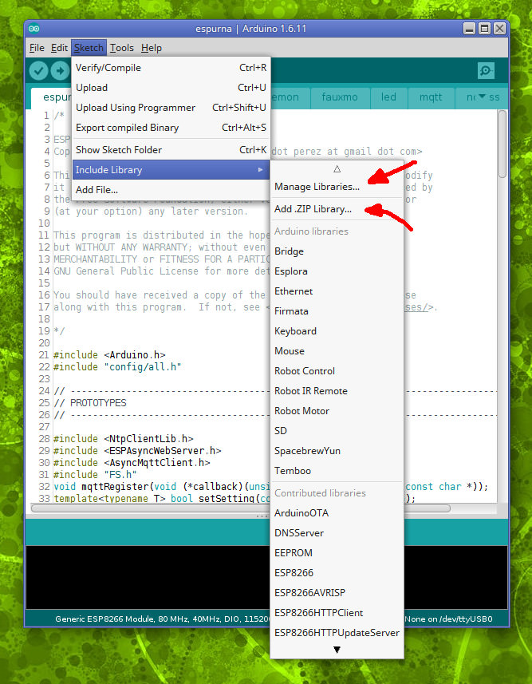
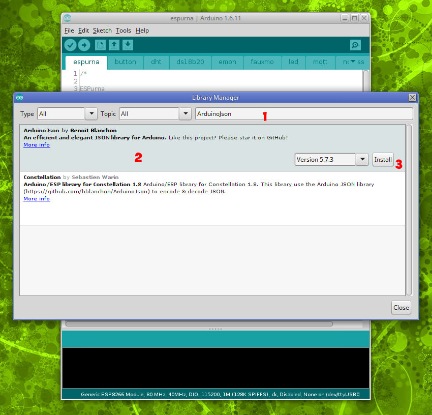
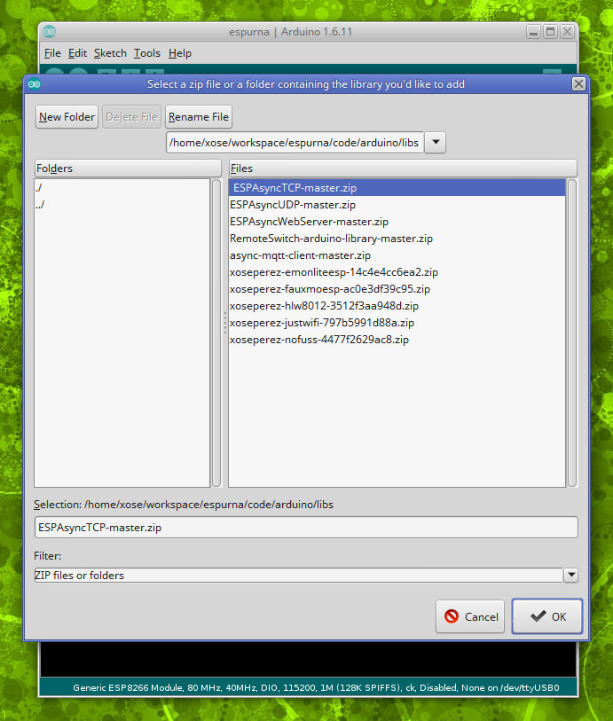

## **Setting up the IDE** ##

### Install the Arduino Core for ESP8266 ###

First step is to install support for ESP8266 based boards on the Arduino IDE through the Board Manager. These instruction are copied and adapted from the Arduino Core for ESP8266 documentation here: [https://github.com/esp8266/Arduino/blob/master/doc/installing.md](https://github.com/esp8266/Arduino/blob/master/doc/installing.md). 

- Start Arduino and open Preferences window.
- Enter ```http://arduino.esp8266.com/stable/package_esp8266com_index.json``` into *Additional Board Manager URLs* field. You can add multiple URLs, separating them with commas.
- Open Boards Manager from Tools > Board menu and find *esp8266* platform.
- Select the version you need from a drop-down box.
- Click *install* button.

### Install the SPIFFS uploader

Again, these steps are taken from the documentation in the Arduino Core for ESP8266 project here: [https://github.com/esp8266/Arduino/blob/master/doc/filesystem.md#uploading-files-to-file-system](https://github.com/esp8266/Arduino/blob/master/doc/filesystem.md#uploading-files-to-file-system)

- Download the tool: https://github.com/esp8266/arduino-esp8266fs-plugin/releases/download/0.2.0/ESP8266FS-0.2.0.zip.
- In your Arduino sketchbook directory, create `tools` directory if it doesn't exist yet
- Unpack the tool into `tools` directory (the path will look like `<home_dir>/Arduino/tools/ESP8266FS/tool/esp8266fs.jar`)
- Restart Arduino IDE

Now, when you open the ESPurna project you should see an option under "Select Tools > ESP8266 Sketch Data Upload". This should start uploading the files into ESP8266 flash file system. When done, IDE status bar will display `SPIFFS Image Uploaded` message.

## **Installing dependencies** ##

The ESPurna project relies on several 3rd party and custom libraries. These libraries have to be loaded in you arduino environment before attempting to build the project. Some of these libraries are available through the library manager in Arduino IDE, others you will have to install them manually.



### Installing libraries from the Library Manager ###

Click on the "Manage Libraries" menú under "Sketch > Include Library". You will be presented a form with a search box on top. The first thing it will do is to connect to the Arduino servers to download the latest list of available libraries. Then you will have to search and install them. Please note that some libraries are optional and depend on the functionalities you want to include.

This is the list, in **bold** the text you have to search for:

|Library|Notes|
|-|-|
|**ArduinoJson** by Benoit Blanchon||
|**Embedis** by David Turnball and Tom Moxon||
|**NtpCLientLib** by German Martin||
|**PubSubClient** by Nick O'Leary|Since version 1.6.5. **Read note 1 below**|
|**DHT Sensor Library** by Adafruit|Only for DHT support|
|**Adafruit Unified Sensor** by Adafruit|Only for DHT support|
|**OneWire** by Paul Stoffregen (et al.)|Only for DS18B20 support|
|**DallasTemperature** by Miles Burton (et al.)|Only for DS18B20 support|


Note 1: The PubSubClient library requires a little modification in order to work with long MQTT message payloads (like when using Domoticz integration). You will need to edit the ```PubSubClient.h``` file, line 26 and change the MQTT_MAX_PACKET_SIZE to at least 400.


```
// MQTT_MAX_PACKET_SIZE : Maximum packet size
#ifndef MQTT_MAX_PACKET_SIZE
#define MQTT_MAX_PACKET_SIZE 400
#endif

```




### Installing libraries manually ###

You will have to install manually the libraries that are not available from the Library Manager. The Arduino IDE lets you install a library from a ZIP file, so we will download all the required libraries from their repositories in a ZIP file and install them. You can look for them manually but I have gathered the URLs to those ZIP files here for convenience:

|Library|Repository|ZIP|Notes|
|-|-|-|-|
|**Time** by Michael Maregolis and Paul Stoffregen (fork)|[GIT](https://github.com/xoseperez/Time)|[ZIP](https://github.com/xoseperez/Time/archive/master.zip)||
|**ESPAsyncTCP** by Hristo Gochkov|[GIT](https://github.com/me-no-dev/ESPAsyncTCP)|[ZIP](https://github.com/me-no-dev/ESPAsyncTCP/archive/master.zip)||
|**ESPAsyncUDP** by Hristo Gochkov|[GIT](https://github.com/me-no-dev/ESPAsyncUDP)|[ZIP](https://github.com/me-no-dev/ESPAsyncUDP/archive/master.zip)||
|**ESPAsyncWebServer** by Hristo Gochkov|[GIT](https://github.com/me-no-dev/ESPAsyncWebServer)|[ZIP](https://github.com/me-no-dev/ESPAsyncWebServer/archive/master.zip)||
|**AyncMqttClient** by Marvin Roger|[GIT](https://github.com/marvinroger/async-mqtt-client)|[ZIP](https://github.com/marvinroger/async-mqtt-client/archive/master.zip)|Not needed if using PubSubClient|
|**DebounceEvent** by Xose Pérez|[GIT](https://bitbucket.org/xoseperez/debounceevent)|[ZIP](https://bitbucket.org/xoseperez/debounceevent/get/master.zip)||
|**JustWifi** by Xose Pérez|[GIT](https://bitbucket.org/xoseperez/justwifi)|[ZIP](https://bitbucket.org/xoseperez/justwifi/get/master.zip)||
|**FauxmoESP** by Xose Pérez|[GIT](https://bitbucket.org/xoseperez/fauxmoesp)|[ZIP](https://bitbucket.org/xoseperez/fauxmoesp/get/master.zip)||
|**HLW8012** by Xose Pérez|[GIT](https://bitbucket.org/xoseperez/hlw8012)|[ZIP](https://bitbucket.org/xoseperez/hlw8012/get/master.zip)|Only for Sonoff POW|
|**EmonLiteESP** by Xose Pérez|[GIT](https://bitbucket.org/xoseperez/emonliteesp)|[ZIP](https://bitbucket.org/xoseperez/emonliteesp/get/master.zip)|Only for current sensor support|
|**my9291** by Xose Pérez|[GIT](https://github.com/xoseperez/my9291)|[ZIP](https://github.com/xoseperez/my9291/archive/master.zip)|Only for AI Thinker Wifi Light|
|**RemoteSwitch** by Randy Simons (fork)|[GIT](https://github.com/xoseperez/RemoteSwitch-arduino-library)|[ZIP](https://github.com/xoseperez/RemoteSwitch-arduino-library/archive/master.zip)|Only for custom RF support|
|**NoFUSS** by Xose Pérez|[GIT](https://bitbucket.org/xoseperez/nofuss)|[ZIP](https://bitbucket.org/xoseperez/nofuss/get/master.zip)|Only for unattended OTA updates support|

Download the ZIP files from the links in the table above only for those libraries you actually need. If you are unsure start with the mandatory ones. Then use the menu under "Sketch > Include Library > Add .ZIP Library..." and load them one by one.



Depending on your level of GIT confidence you can checkout the repositories for all of them into your library folder instead of installing them as ZIP files.

**Note: when updating the project to a newer version, come back here and update the libraries before reporting an issue in the issue tracker.**

## Open ESPurna in the IDE ##

Assuming you have already checked out the project from bitbucket using git, you just have to open the ```code/espurna/espurna.ino``` file. The rest of the files will open as tabs in the IDE. Unfortunately the IDE does not support opening files under subfolders, and that includes the configuration files you will have to modify in the next step.

## Configuring the hardware ##

The ESPurna firmware uses build flags to target specific boards or enable support for certain sensors. The Arduino IDE does not have a friendly way to specify build flags from the interface so the best option is to manually modify the '**code/espurna/config/arduino.h**' file to define what we want to build. Edit that file with your favourite editor (it's not accessible from the IDE, the pic below is from Atom) and uncomment the options to suit your need. In the example below we are compiling for Sonoff TH with DHT support.


Also, you might want to take a look at other compilation options and default values in '**code/espurna/config/general.h**'.

## Building & Flashing the firmware ##

First you will have to choose the right board and memory map. Here you have a list of the supported board types and the suggested memory layout to use:

|Board type|Board names|Flash size|
|-|-|-|
|Generic ESP8266 module|Sonoff Basic, Sonoff TH, Sonoff POW, Sonoff Dual, Slampher, S20, 1CH selflock/inching, motor cw/acw, Ecopplug, Jan Goedeke's boards|1M (128K SPIFFS)|
|Generic ESP8285 module|Sonoff 4CH, Sonoff Touch, AI-Thinker Wifi Light|1M (128K SPIFFS)|
|ESP-12 based modules|Wemos D1 & D1 mini, NodeMCU, Electrodragon, OpenEnergyMonitor MQTT Relay Board, |4M (1M SPIFFS)|


Now you are ready to build the project clicking on the 'tick' button. Take a close look at the output window in the IDE for errors (in red). Common errors here could be missing libraries (go back to the installing dependencies section above) or the "Unsupported hardware" error, meaning you have not defined the target device (go back to the configuring hardware section).

Finally, if there were no errors, connect your device (check the [Hardware](Hardware.md) document for instruction on how to connect your device to flash it), choose the port your programmer is listening to, and flash it clicking on the 'upload' button.

## Flashing the filesystem ##

You could stop here and start using your device with the newly installed ESPurna firmware and the default configuration values in '**code/espurna/config/general.h**', but if you want to be able to modify those settings you should upload the web interface to the SPIFFS partition.

The already compiled version of web interface is under the '**code/espurna/data/**' folder. Use the **ESP8266 Sketch Data Upload** menu under "Tools" to upload it. Again, check the [Hardware](Hardware.md) document for instructions on how to wire and set your board in flash mode.

If you want to make changes to the web interface you have to edit the contents under 'code/html' and build it again. Read the [filesystem](Filesystem.md] document for more information.