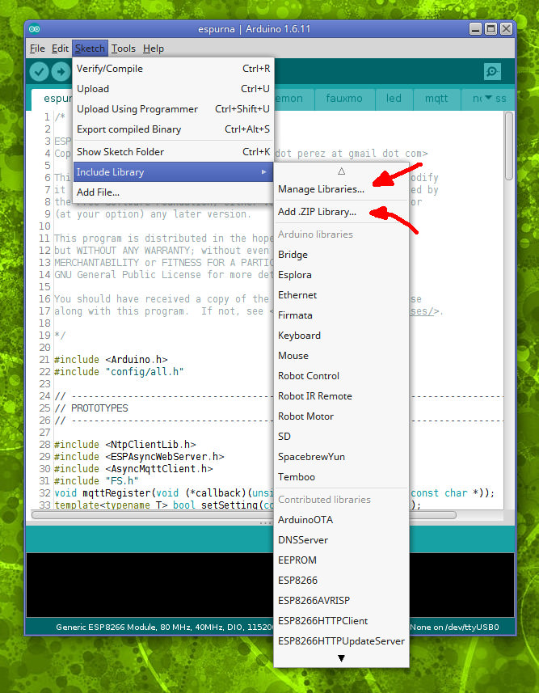
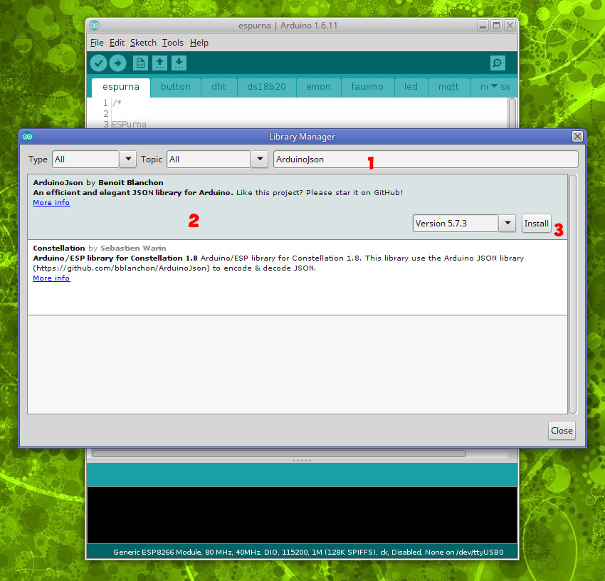
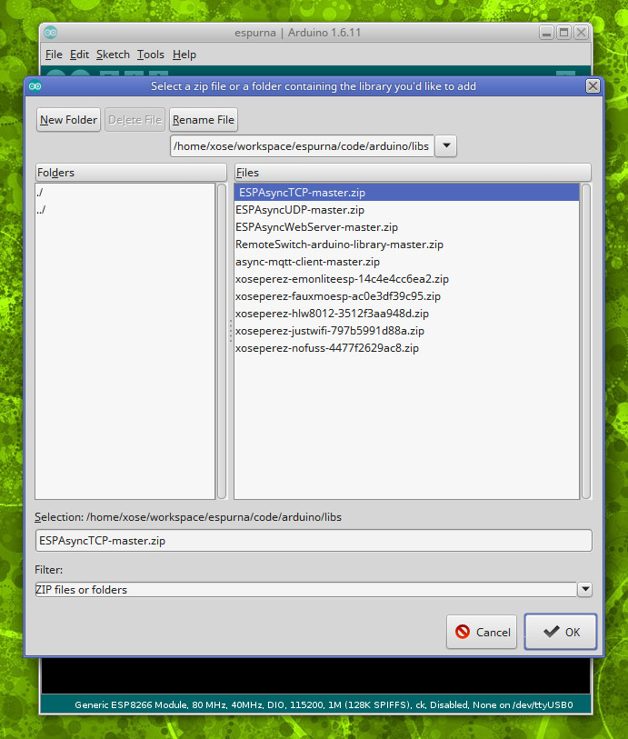
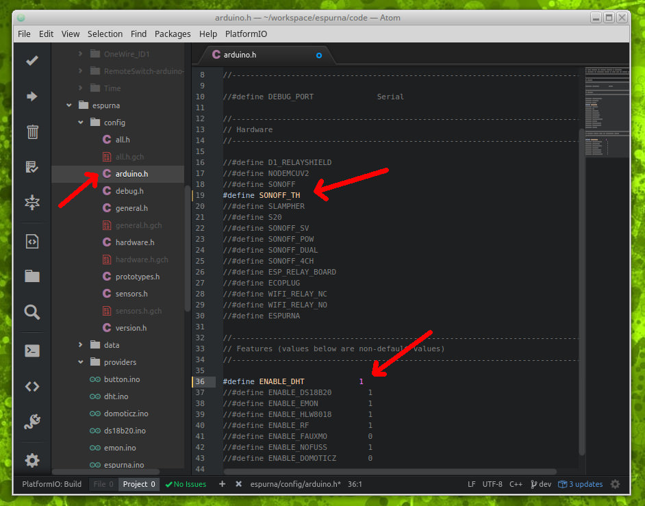
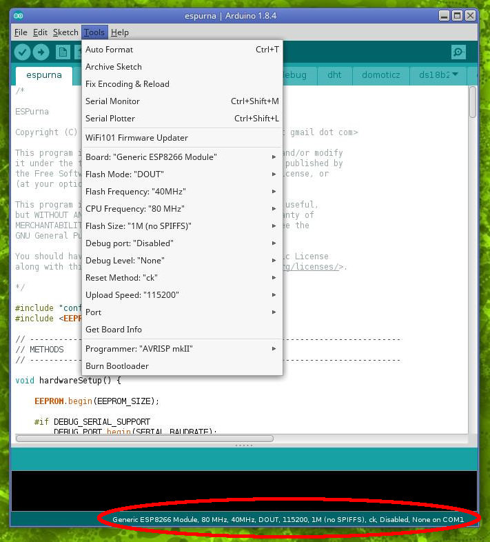

## **Installing the Arduino IDE** ##

You can install the Arduino IDE by downloading it from [arduino.cc](https://www.arduino.cc/en/Main/Software). Do not download the installer but the compressed file targeted to your OS. This way you will be able to decompress it on your system or on an USB pendrive for instance and carry it with you anywhere. They call it **portable** Arduino IDE.

All you have to do is decompress it (unzip it or unbzip it) where you want, open the folder and create a "portable" subfolder there. Now you can open the Arduino IDE by clicking on the executable.

## **Setting up the IDE** ##

### Install the Arduino Core for ESP8266 ###

First step is to install support for ESP8266 based boards on the Arduino IDE through the Board Manager. These instruction are copied and adapted from the Arduino Core for ESP8266 documentation here: [https://github.com/esp8266/Arduino/blob/master/doc/installing.md](https://github.com/esp8266/Arduino/blob/master/doc/installing.md).

- Start Arduino and open Preferences window.
- Enter `http://arduino.esp8266.com/stable/package_esp8266com_index.json` into *Additional Board Manager URLs* field. 
- Open Boards Manager from Tools > Board menu and find *esp8266* platform.
- Select the version you need from a drop-down box.
- Click *install* button.

**NOTE: latest version of the Arduino Core for ESP8266 is 2.4.0. At the moment, pre-build binaries of ESPurna are still built using 2.3.0 version.**

## **Add a new flash layout** ##

**This step is not required but strongly recommended.**

**This step is only necessary when using Arduino Core for ESP8266 2.3.0. New version 2.4.0 already comes with the 1M0 layout defined.** 

To increase the available space for firmware on 1M boards it's a good idea to use a flash layout with no partition for SPIFFS, since ESPurna does not use it. Unfortunately there is no layout available for 1M boards without SPIFFS, so we will have to modify some files in out "portable" folder to achieve this.

First edit the '**\<arduino folder\>/portable/packages/esp8266/hardware/esp8266/2.3.0/boards.txt**' file and locate the definitions for `generic.menu.FlashSize.1M64`. These few lines define a layout for 1Mbytes ESP8266 boards with 64KBytes SPIIFS. You will have to create a new group of lines below that one for our new layout:

```
generic.menu.FlashSize.1M0=1M (no SPIFFS)
generic.menu.FlashSize.1M0.build.flash_size=1M
generic.menu.FlashSize.1M0.build.flash_ld=eagle.flash.1m0.ld
generic.menu.FlashSize.1M0.upload.maximum_size=1023984

```

Same thing for ESP8295 boards, locate the `esp8285.menu.FlashSize.1M64` group of lines and copy the following line below that one:

```
esp8285.menu.FlashSize.1M0=1M (no SPIFFS)
esp8285.menu.FlashSize.1M0.build.flash_size=1M
esp8285.menu.FlashSize.1M0.build.flash_ld=eagle.flash.1m0.ld
esp8285.menu.FlashSize.1M0.upload.maximum_size=1023984

```

These new flash layout refer to a file ('**eagle.flash.1m0.ld**') that does not exist, so we will create that one too. It has to be in '**\<arduino folder\>/portable/packages/esp8266/hardware/esp8266/2.3.0/tools/sdk/ld/eagle.flash.1m0.ld**' with these contents:

```
/* Flash Split for 1M chips, no SPIFFS */
/* sketch 999KB */
/* eeprom 20KB */

MEMORY
{
  dport0_0_seg :                        org = 0x3FF00000, len = 0x10
  dram0_0_seg :                         org = 0x3FFE8000, len = 0x14000
  iram1_0_seg :                         org = 0x40100000, len = 0x8000
  irom0_0_seg :                         org = 0x40201010, len = 0xf9ff0
}

PROVIDE ( _SPIFFS_start = 0x402FB000 );
PROVIDE ( _SPIFFS_end = 0x402FB000 );
PROVIDE ( _SPIFFS_page = 0 );
PROVIDE ( _SPIFFS_block = 0 );

INCLUDE "../ld/eagle.app.v6.common.ld"
```

Done! Now if you restart your Arduino IDE and select either "ESP8266 Generic Module" or "ESP8285 Generic Module" you should see a "1M (no SPIFFS)" option under Flash Size. That's the one you should use.

## **Installing dependencies** ##

The ESPurna project relies on several 3rd party and custom libraries. These libraries have to be loaded in you arduino environment before attempting to build the project. Some of these libraries are available through the library manager in Arduino IDE, others you will have to install them manually.



### Installing libraries from the Library Manager ###

Click on the "Manage Libraries" menu under "Sketch > Include Library". You will be presented a form with a search box on top. The first thing it will do is to connect to the Arduino servers to download the latest list of available libraries. Then you will have to search and install them. Please note that some libraries are optional and depend on the functionalities you want to include.

This is the list, in **bold** the text you have to search for:

|Library|Notes|
|-|-|
|**ArduinoJson** by Benoit Blanchon||
|**Brzo I2C** by Pascal Kurtansky|Required when I2C_USE_BRZO is 1|
|**Embedis** by David Turnball and Tom Moxon||
|**IRRemoteESP8266** by Sebastien Warin et al.|Required when IR_SUPPORT is 1|
|**NtpCLientLib** by German Martin||
|**OneWire** by Paul Stoffregen (et al.)|Required when DALLAS_SUPPORT is 1|
|**PMS Library** by Mariusz Kacki|Required when PMSX003_SUPPORT is 1|
|**PubSubClient** by Nick O'Leary|Required when MQTT_USE_ASYNC is 0. Read note below|

**Note**: The PubSubClient library requires a little modification in order to work with long MQTT message payloads (like when using Domoticz integration). You will need to edit the '**PubSubClient.h**' file (for me that file is under the '**C:\Users\xose\Documents\Arduino\libraries\arduino_281549\src\PubSubClient.h**' folder), line 26 and change the MQTT_MAX_PACKET_SIZE to at least 400.

```
// MQTT_MAX_PACKET_SIZE : Maximum packet size
#ifndef MQTT_MAX_PACKET_SIZE
#define MQTT_MAX_PACKET_SIZE 400
#endif

```




### Installing libraries manually ###

You will have to install manually the libraries that are not available from the Library Manager. The Arduino IDE lets you install a library from a ZIP file, so we will download all the required libraries from their repositories in a ZIP file and install them. You can look for them manually but I have gathered the URLs to those ZIP files here for convenience:

|Library|Repository|ZIP|Notes|
|-|-|-|-|
|**AsyncMqttClient** by Marvin Roger|[GIT](https://github.com/marvinroger/async-mqtt-client)|[ZIP](https://github.com/marvinroger/async-mqtt-client/archive/master.zip)|Required if MQTT_USE_ASYNC is 1 (default value)|
|**DebounceEvent** by Xose Pérez|[GIT](https://bitbucket.org/xoseperez/debounceevent)|[ZIP](https://bitbucket.org/xoseperez/debounceevent/get/master.zip)||
|**ESPSoftwareSerial** fork by Oscar rovira|[GIT](https://github.com/krosk93/espsoftwareserial)|[ZIP](https://github.com/krosk93/espsoftwareserial/archive/master.zip)|Required if either MHZ19_SUPPORT, PMSX003_SUPPORT or V9261F_SUPPORT are set to 1|
|**ESPAsyncTCP** by Hristo Gochkov|[GIT](https://github.com/me-no-dev/ESPAsyncTCP)|[ZIP](https://github.com/me-no-dev/ESPAsyncTCP/archive/master.zip)|See note 1 below|
|**ESPAsyncWebServer** by Hristo Gochkov|[GIT](https://github.com/me-no-dev/ESPAsyncWebServer)|[ZIP](https://github.com/me-no-dev/ESPAsyncWebServer/archive/master.zip)|See note 2 below|
|**FauxmoESP** by Xose Pérez|[GIT](https://bitbucket.org/xoseperez/fauxmoesp)|[ZIP](https://bitbucket.org/xoseperez/fauxmoesp/get/master.zip)|Required if ALEXA_SUPPORT is 1 (default value)|
|**HLW8012** by Xose Pérez|[GIT](https://bitbucket.org/xoseperez/hlw8012)|[ZIP](https://bitbucket.org/xoseperez/hlw8012/get/master.zip)|Required if HLW8012_SUPPORRT is 1|
|**JustWifi** by Xose Pérez|[GIT](https://bitbucket.org/xoseperez/justwifi)|[ZIP](https://bitbucket.org/xoseperez/justwifi/get/master.zip)||
|**mDNSResolver** by Myles Eftos|[GIT](https://github.com/madpilot/mDNSResolver)|[ZIP](https://github.com/madpilot/mDNSResolver/archive/master.zip)|Required if MDNS_CLIENT_SUPPORT is 1|
|**my92xx** by Xose Pérez|[GIT](https://github.com/xoseperez/my92xx)|[ZIP](https://github.com/xoseperez/my92xx/archive/master.zip)|Required if LIGHT_PROVIDER_MY92XX|
|**NoFUSS** by Xose Pérez|[GIT](https://bitbucket.org/xoseperez/nofuss)|[ZIP](https://bitbucket.org/xoseperez/nofuss/get/master.zip)|Required if NOFUSS_SUPPORT is 1|
|**RemoteSwitch** by Randy Simons (fork)|[GIT](https://github.com/xoseperez/RemoteSwitch-arduino-library)|[ZIP](https://github.com/xoseperez/RemoteSwitch-arduino-library/archive/master.zip)|Required if RF_SUPPORT is 1|
|**Time** by Michael Maregolis and Paul Stoffregen (fork)|[GIT](https://github.com/xoseperez/Time)|[ZIP](https://github.com/xoseperez/Time/archive/master.zip)||


(1) If you are using Arduino core 2.3.0 stable, please install and use this version, [ESPAsyncTCP #9b0cc37](https://github.com/me-no-dev/ESPAsyncTCP#9b0cc37).

(2) Please note that versions newer than https://github.com/me-no-dev/ESPAsyncWebServer/commit/313f3372c61f6f4bff9c157f02a07ba912d3d4d9 have been reported as having websocket authentication issues with Safari and iOS. It is recommended to use that commit version for the moment.

Download the ZIP files from the links in the table above only for those libraries you actually need. If you are unsure start with the mandatory ones. Then use the menu under "Sketch > Include Library > Add .ZIP Library..." and load them one by one.



Depending on your level of GIT confidence you can check out the repositories for all of them into your library folder instead of installing them as ZIP files.

**Note: when updating the project to a newer version, come back here and update the libraries before reporting an issue in the issue tracker.**

## Open ESPurna in the IDE ##

Assuming you have already checked out the project from github using git, you just have to open the '**code/espurna/espurna.ino**' file. The rest of the files will open as tabs in the IDE. Unfortunately the IDE does not support opening files under subfolders, and that includes the configuration files you will have to modify in the next step.

## Configuring the hardware ##

The ESPurna firmware uses build flags to target specific boards or enable support for certain sensors. The Arduino IDE does not have a friendly way to specify build flags from the interface so the best option is to manually modify the '**code/espurna/config/arduino.h**' file to define what we want to build. Edit that file with your favorite editor (it's not accessible from the IDE, the pic below is from Atom) and uncomment the options to suit your need. In the example below we are compiling for Sonoff TH with DHT support.



Also, you might want to take a look at other compilation options and default values in '**code/espurna/config/general.h**'.

## Building & Flashing the firmware ##

First you will have to choose the right board and memory map. Here you have a list of the supported board types and the suggested memory layout to use:

|Board type|Board names|Flash size|Flash mode|
|-|-|-|-|
|ESP-12 based modules|Wemos D1 & D1 mini, NodeMCU, Electrodragon, OpenEnergyMonitor MQTT Relay Board,... |4M (3M SPIFFS)|DOUT|
|Generic ESP8285 module|Sonoff 4CH, Sonoff 4CH Pro, Sonoff Touch, Sonoff B1, Sonoff T1, AI-Thinker Wifi Light|1M (no SPIFFS)*|DOUT|
|Generic ESP8266 module|All the rest|1M (no SPIFFS)*|DOUT|

* If you don't see the "1M (no SPIFFS)" option check the "Add a new flash layout" section above. If you still don't see it or you don't want to modify those files you can safely use the "1M (64F SPIFFS)" option for the moment.



**NOTE**: There are some reports of unstability using Arduino Core 2.4.0 and the new "IwIP v2 Prebuilt (unstable)". If you are experiencing these kind of problems try compiling it changing the IwIP Variant to "V1.4 Prebuilt".

Now you are ready to build the project clicking on the 'tick' button. Take a close look at the output window in the IDE for errors (in red). Common errors here could be missing libraries (go back to the installing dependencies section above) or the "Unsupported hardware" error, meaning you have not defined the target device (go back to the configuring hardware section).

Finally, if there were no errors, connect your device (check the [Hardware](Hardware) document for instruction on how to connect your device to flash it), choose the port your programmer is listening to, and flash it clicking on the 'upload' button.
