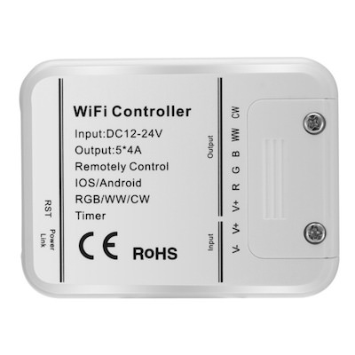

# Arilux AL-LC06

|Property|Value|
|---|---|
|Manufacturer|Arilux|
|Product page||
|Wiki page||
|Build flag|`ARILUX_AL_LC06`|

## Introduction

Working Voltage: DC12-24V 
Output Channel: 5 Channel RGB color, WW(Warm white), CW(Cool white) 
Output Current: RGB/WW/CW,4Ax5 
Max. Power: 4AX5X24V=480W 
Connection: Common anode 
Dimension: L105.5 x W45 x H23(mm) 
Working Temperature: -10 .. 55℃

## Flashing

*TODO*

## Issues

*TODO*