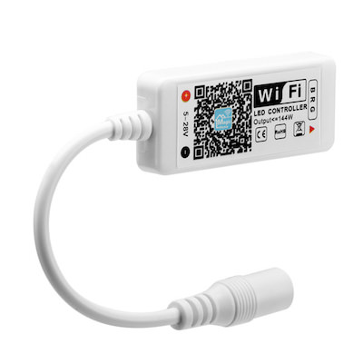

# Arilux AL-LCxx

|LC01|LC02|LC11|
|---|---|---|
||||

|Property|Value|
|---|---|
|Manufacturer|Arilux|
|Product page||
|Wiki page||
|Build flag|`ARILUX_AL_LC01` `ARILUX_AL_LC02` `ARILUX_AL_LC02_V14`  `ARILUX_AL_LC11`|

## Introduction

|   |LC01|LC02|LC11|
|---|---|---|---|
|Working Voltage (DC)|5-28V|9-12V (version 1.4): 9-28V|9-28V|
|Output Channels|3|4|5|
|Output Type|RGB|RGBW|RGBW/WW|
|Output Current|4A x 3|4A x 4|4A x 5|
|Max. Power|≤144W|≤192W|≤240W|
|Connection|Common anode|Common anode|Common anode|
|Dimension (approx)|L46 x W19 x H8 mm|L46 x W19 x H8 mm|L46 x W19 x H8 mm|

### Version 1.4 of LC02 and incorrect colours on output ###
Now you may encounter newer version of AL-LC02 devices being sold that uses different output pins than older ones. Result is that if you flash "normal" LC02 espurna firmware you'll have mismatched RGBW output (green ok, blue light instead of red, white light instead of blue).
Solution is to use espurna firmware arilux-al-lc02**v14** dedicated for those devices which has correct pins mapped.
From outside only difference is input voltage printed on the label (9-28V on devices with 1.4 version and 9-12V on most of the older ones). Unfortunately only way to be 100% sure that you have 1.4 device is to check version number printed on the PCB inside the device.

## Flashing

Open the plastic enclosure (using a sharp tool) and extract the little board inside.

You will see some soldering points with labels: GND, TX, RX and I00. If you are good enought with the soldering iron, connect dupont wires to these pads ([check this guide](Hardware-Magic-Home-LED-Controller)). 

If you prefer to got the safe way, use this tricky method: 

* bend the tip of some dupont wires 
* glue the tip to a short piece of a ziptie
* hold the board in place with a couple of pins,
* hold the the zipties with clothespins
* adjust the tips of the dupont wires placing them carefully on the soldering pads 

Finally, connect the dupont wires to your FTDI-USB dongle:

* TX -> RX
* RX -> TX
* GND and I00 -> GND

And follow the general instructions in [this page](Binaries) to start the flashing procedure. 

## Issues

*TODO*