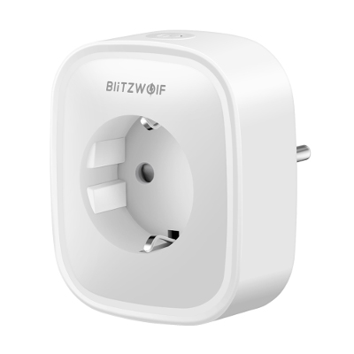

# BLITZWOLF BW-SHP2



|Property|Value|
|---|---|
|Manufacturer|BlitzWolf|
|Product page|[BlitzWolf Link](https://www.blitzwolf.com/Wifi-Smart-Socket-EU-p-244.html)<br>[AliExpress Link](https://www.aliexpress.com/item/BlitzWolf-BW-SHP2-WIFI-Smart-Socket-EU-Plug-220V-16A-Remote-Control-Smart-Timing-Switch-Work/32871562977.html)<br>[Banggood Link](https://www.banggood.com/BlitzWolf-BW-SHP2-Smart-WIFI-Socket-EU-Plug-220V-16A-Work-with-Amazon-Alexa-Google-Assistant-p-1292899.html)|
|Wiki page||
|Build flag|`BLITZWOLF_BWSHP2`|

## Introduction

* Rated voltage: AC 110-240V 
* Rated current: 16A (3840W)
* Product size: L5.08 x W7.62

## Flashing

Open the device using special tools (the [Xiaomi Wiha 24-in-1 toolkit](https://www.banggood.com/XIAOMI-Wiha-25-in-1-Screwdrivers-Kits-With-24pcs-S2-Steel-Screw-Bits-and-Aluminium-Alloy-Screwdriver-p-1187158.html) has it):


Short GPIO0 and GND during boot to enter flash mode before connecting to the serial programmer. The power indicator LED will be strong red to confirm the device has entered this mode. As soon as the short is removed, the red color will be dimmed. The device will then be ready for flashing.


@pilzandreas sent a clever way to flash this device and compatible ones (check https://github.com/xoseperez/espurna/issues/1238)


1. pins:
   ```
   DTR - nc
   RX - orange
   TX - yellow
   VCC - green
   CTS - nc
   GND - brown
   ```
1. splitting GND (brown) to blue and black cable
1. blue - GND (from splitter pin)
1. orange - RX
1. green - VCC
1. low - TX
1. tip with black (from splitter pin) on boot to init flash mode - note: there is one free pin betw(7)  (6) and 1. even if it seems the black wire would be connected the pin next to (6) - its just hanging loosely on my photo.

You will find these power plugs being sold under various labels - i bought a pack of 4 and another with 2 labeld TFLAG (ASIN B07D2Z3YVM) and TECKIN (ASIN B07D5V139R).

Using windows flashing the compiled images offered here worked well doing:
* (reboot, short (7) with black, red light dims as you release the pin)
* esptool.py --port COM8 erase_flash
* (reboot, short (7) with black, red light dims as you release the pin)
* esptool.py --port COM8 write_flash --flash_mode dout 0x00000 espurna-1.13.1-blitzwolf-bwshp2.bin
* (reboot)
* connect wifi to test 'espurna_xxxxx' pw fibonacci 
* browse to http://192.168.4.1 (admin/fibonacci)
* logged in