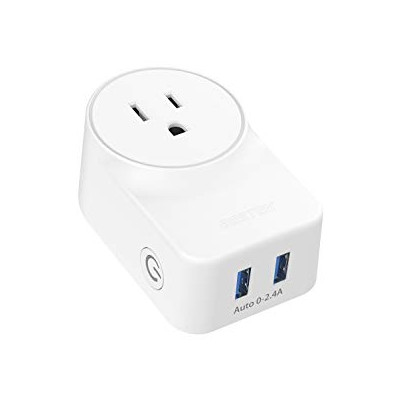

# Bestek MRJ1011

|Property|Value|
|---|---|
|Manufacturer|Bestek|
|Product page|[Bestek](https://www.bestekcorp.com/bestek-smart-plug-works-with-amazon-alexa-google-assistant-and-ifttt-with-2-usb), [Amazon](https://www.amazon.com/Charging-BESTEK-Google-Assistant-MRJ1011/dp/B07BNG9ZSV)|
|Wiki page||
|Build flag|`BESTEK_MRJ1011`|

## Introduction

* Max load: AC125V, 10A 
* With 2 Auto 0-2.4A USB Charging Ports. 
* Product size: 3.2 x 1.9 x 1.5 inches

## Flashing
The switch can be easily opened by removing the only screw on the back under the BESTEK label and gently prying from the notch on right side.

It uses [TYWE2S](https://docs.tuya.com/en/hardware/WiFi-module/wifi-e2s-module.html) Wi-Fi module which contains ESP8255 radio chip with 1MB flash. The module inserts into the main board vertically and has  3.3V, Gnd, Rx and Tx pins on one end. The GPIO0 pad on the back side.

Just connecting serial pins at 115200 baud dumped the familiar content
<pre>
ets Jan  8 2013,rst cause:4, boot mode:(3,7)

wdt reset
load 0x40100000, len 1396, room 16
tail 4
chksum 0x89
load 0x3ffe8000, len 776, room 4
tail 4
chksum 0xe8
load 0x3ffe8308, len 540, room 4
tail 8
chksum 0xc0
csum 0xc0

2nd boot version : 1.4(b1)
  SPI Speed      : 40MHz
  SPI Mode       : DOUT
  SPI Flash Size & Map: 8Mbit(512KB+512KB)
jump to run user1 @ 1000
</pre>

Soldering is tricky.

You can first desolder the power plugs and then solder wires to the end of TYWE2S sticking out on other side or just solder wires which is what I did. The GPIO 0 pad on the back, you can just press a wire to Gnd temporary while you power the module from 3.3V.

*TODO*

## Issues

*TODO*
