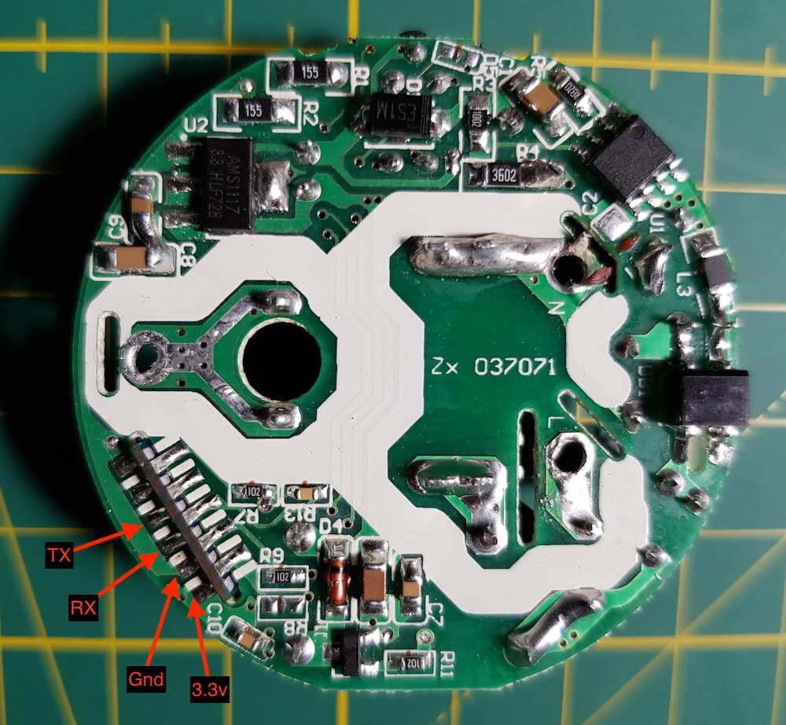

# HEYGO HY02

|Property|Value|
|---|---|
|Manufacturer|HEYGO|
|Product page|[Amazon Link](https://www.amazon.com/gp/product/B075DJL39W/ref=oh_aui_detailpage_o05_s00?ie=UTF8&psc=1)|
|Wiki page||
|Build flag|`HEYGO_HY02`|

## Introduction

* Input voltage: AC100-240V 50/60Hz
* Wattage: 1100 watts
* Amperage Capacity: 10A
* Dimensions: 2 x 2 x 1.8"
* Thickness: 1.1"

## Flashing

*TODO*

## Issues

*TODO*