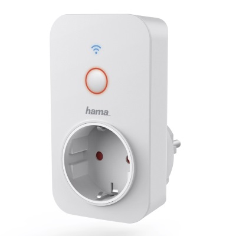
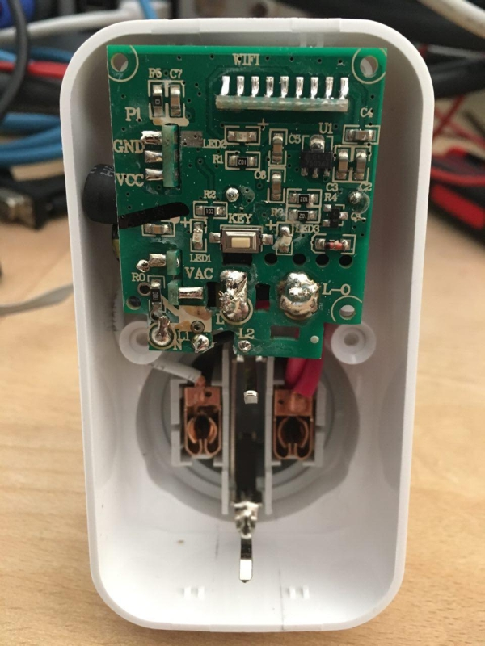
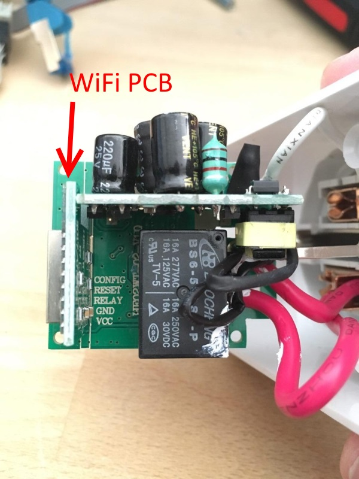
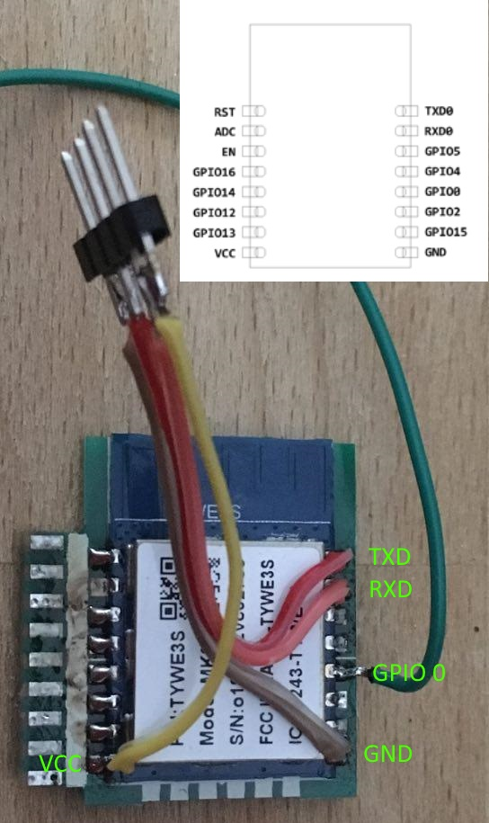

# Hama WiFi Steckdose (00176533)

|Property|Value|
|---|---|
|Manufacturer|Hama|
|Product page|[https://at.hama.com/00176533/hama-wifi-steckdose-3500w-16a](https://at.hama.com/00176533/hama-wifi-steckdose-3500w-16a)|
|Build flag|`HAMA_WIFI_STECKDOSE_00176533`|
|Voltage|3V3 MCU, 5V relay|

## Introduction

The [Hama WiFi Steckdose 00176533](https://at.hama.com/00176533/hama-wifi-steckdose-3500w-16a) is a smart plug that comes with a Schuko-F plug. It is meant turn any regular wall outlet into a smart outlet. It sports a button for manual operation and two LEDs, a red one in sync with the relay status and the other blue one for the WiFi status.

There is a identically looking one with a different article number available, these instructions here cover the **00176533** model (written on the rear label). 

If someone has the [00176552](https://de.hama.com/00176552/hama-wifi-steckdose-3680w-16a) model and can confirm these instructions work for this model too, please report.

## Flashing

There is a custom WiFi PCB based on a [TYWE3S module](https://docs.tuya.com/en/hardware/WiFi-module/wifi-e3s-module.html) soldered perpendicular into the main PCB
 

I found it easiest to remove the add on board by desoldering it from the main PCB and attach some wires with a pinheader to it, supplying it with 3.3V from my USB-UART converter.

Looks something like this then:

GPIO 0 must be held on GND while connecting it to the UART converter. Can be flashed normally then. Flash size is 1MegaByte