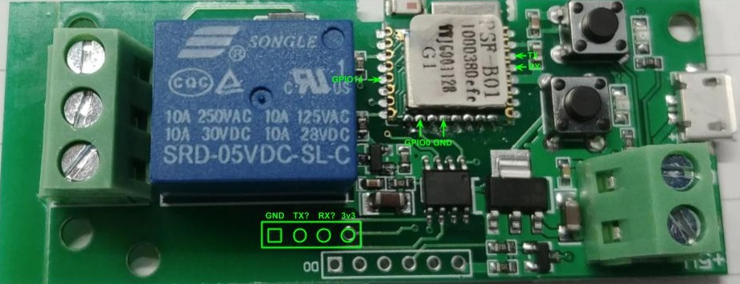

# Itead 1CH Inching

|Property|Value|
|---|---|
|Manufacturer|Itead Studio|
|Product page|[https://www.itead.cc/smart-home/inching-self-locking-wifi-wireless-switch.html](https://www.itead.cc/smart-home/inching-self-locking-wifi-wireless-switch.html)|
|Wiki page|[https://www.itead.cc/wiki/Sonoff](https://www.itead.cc/wiki/Sonoff)|
|Build flag|`ITEAD_1CH_INCHING`|

## Introduction

The IteadStudio 1-channel Inching/Self-locking module is a relay module with a couple of user buttons that can be powered with 5V or 12V. It's meant for custom installations and the stock firmware supports both self-locking mode (you click the button it toggle) and inching mode (you click the button, it toggles once and toggles back after X seconds). It also brings out both normally open and normally close contacts of the relay (something unusual for an Itead product).

There are at least two version of board, the first one based on the PSA-B01 module and the second one based on the PSF-B01 module. Both modules are based on an ESP8255 (that in turn is a ESP8266 with an embedded 1Mbyte flash memory) and are commercialized by Itead (AFAIK).

## Flashing (PSA-B01)

The main button is tied to GPIO0 so you can easily enter flash mode powering the board while pressing the button (the one that’s closer to the electrolytic capacitors). Pins 7, 8 and 9 of the PSA-B module are RX, TX and GND. You can use a 3-pin header or pogo pins to connect it.

Check my post here: [http://tinkerman.cat/the-mysterious-ic/](http://tinkerman.cat/the-mysterious-ic/).

## Flashing (PSF-B01)

Solder some pins to the TX, RX, GPIO0 on the ESP8266 module, then GND and 3v3 on the board below the relay. Connect GPIO0 to the ground terminal of the 5V power input. This way, the board goes straight into flashing mode as soon as it’s powered up.

The connection to the serial breakout is the same as for the 5/12V version:

    TX -> RX
    RX -> TX
    3v3 -> 3v3
    GND -> GND

From here on you can flash it with you favourite tool/IDE. All wires, including GPIO0 to GND can be removed after removing the power source (serial breakout USB).

Pictures and explanation by **Florin Finaru**, thank you! Check his original document [here](https://docs.google.com/document/d/1B37Lv4ATsoNzSFv7-rVEFn2rBZTA1oadgdXeNPQj4ZM/edit).

Make sure to flash as DOUT. Makes an excellent switch for a gas fireplace. Just replace current remote relay with NO and the common. Use pulse mode=Normally Off and pulse time(s) = 1800 to have it auto turn off after 30 minutes

Flashing instructions for the "1CH DC5V/7-32V and RF" are the same as PSF-B01. The only difference is the 4 point header is rotated, but the 4 point header is rotated. The trace still comes from the 3v3 point. The RF learning function is hardware, so no binary modification is needed.

## Issues
 
Nothing reported.