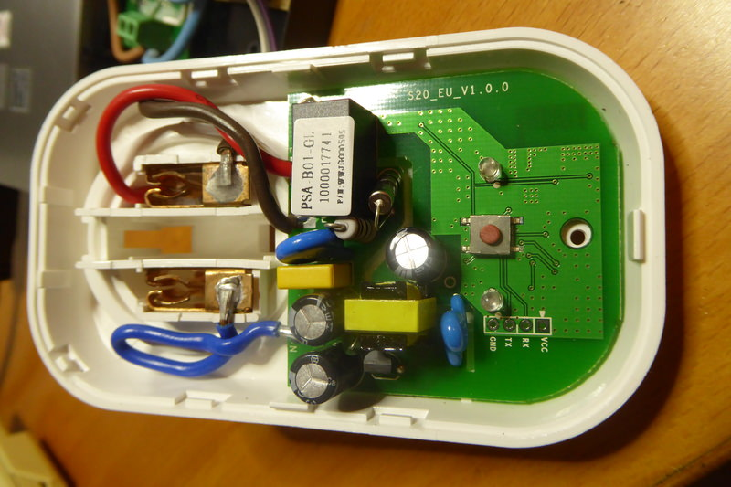

# Itead S20

|Property|Value|
|---|---|
|Manufacturer|Itead Studio|
|Product page|[https://www.itead.cc/smart-socket.html](https://www.itead.cc/smart-socket.html)|
|Wiki page|[https://www.itead.cc/wiki/Sonoff](https://www.itead.cc/wiki/Sonoff)|
|Build flag|`ITEAD_S20`|
|Voltage|3v3|

## Introduction

The Sonoff S20 is a smart plug that comes with different plug standards: EU (both Schuko-F and French-E) , US, UK, CN and AU. It is meant turn any regular wall outlet into a smart outlet. It sports a button for manual operation and two LEDs, one in sync with the relay status and the other one for user notifications.

## Flashing

There is a labeled header in the front of the PCB and the button is connected to GPIO0, so no problems here.

Solder a 4 pin male or female header and connect it to your USB-to-UART bridge.  Then press and hold the button and connect the programmer to your computer. The micro-controller will boot into flash mode and you are ready to update the firmware.