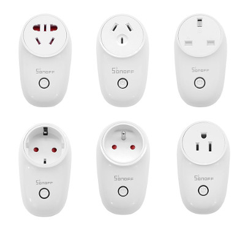

# Itead S26

|Property|Value|
|---|---|
|Manufacturer|Itead Studio|
|Product page|[https://www.itead.cc/sonoff-s26-wifi-smart-plug.html](hhttps://www.itead.cc/sonoff-s26-wifi-smart-plug.html)|
|Build flag|`ITEAD_S20`|
|Voltage|3v3|

## Introduction

The Sonoff S26 is a smart plug that comes with different plug standards: EU (both Schuko-F and French-E), US, UK, CN, and AU. It is meant to turn any regular wall outlet into a smart outlet. It sports a button for manual operation and two LEDs, one in sync with the relay status and the other one for user notifications.

The device is hardware compatible with the S20, so you can use the same image for both devices (espurna-X.X.X-itead-s20.bin).

## Flashing

Flashing the S26 is a little more involved than the S20. You will have to solder 4 cables to the 4 pads in the secondary PCB where the ESP8266 sits. Check the image above by @ruimarinho.

Connect the wires to your USB-to-UART bridge.  Then press and hold the button and connect the programmer to your computer (this might be tricky since the button is not very responsive). The micro-controller will boot into flash mode and you are ready to update the firmware.

User @battika has reported (https://github.com/xoseperez/espurna/issues/980) that he had problems flashing it from a standard USB2UART programmer and it eventually died, allegedly due to the high power the device required. He had to power the board from a different source.

