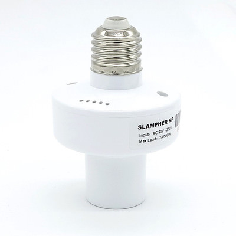

# Itead Slampher 2.0

|Property|Value|
|---|---|
|Manufacturer|Itead Studio|
|Product page|[https://www.itead.cc/slampher.html](https://www.itead.cc/slampher.html)|
|Wiki page|[https://www.itead.cc/wiki/Sonoff](https://www.itead.cc/wiki/Sonoff)|
|Build flag|`ITEAD_SLAMPHER`|
|Voltage|3v3|

## Introduction

*TODO*

## Flashing

New Slampher boards are labeled "Slampher V2.0 2017-04-14". These boards are slightly different.

There is a 4 pin unpopulated header in a border near the ESP8266 chip. Starting form the closer to the drilled hole they are 3V3, TX, RX and GND. Solder a male or female header here and connect your USB-to-UART programmer.

To enter flash mode the ESPurna user Tomasz Pacak recommends shortcutting the ground pad to the R9 resistor pad closer to the ESP8266 (check the image above). Again this is a temporary shortcut. You will have to do it just once (unless there is something really wrong in the firmware) and use OTA updates from there on.

Also, user [PieBru](https://github.com/PieBru) has suggested to add a push button connected between GPIO0 and GND to easily boot the device into flash mode. Check his picture below (adding some hot glue will be a good idea):

## Issues

*TODO*