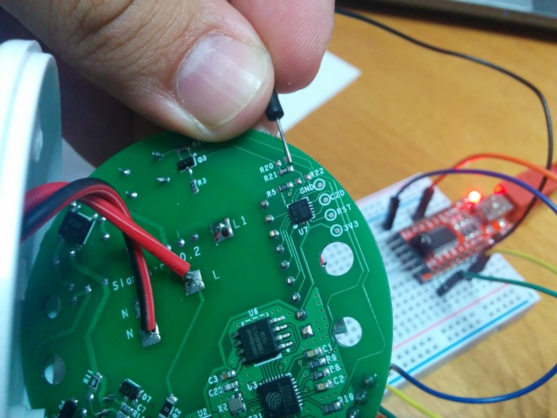

# Itead Slampher

|Property|Value|
|---|---|
|Manufacturer|Itead Studio|
|Product page|[https://www.itead.cc/slampher.html](https://www.itead.cc/slampher.html)|
|Wiki page|[https://www.itead.cc/wiki/Sonoff](https://www.itead.cc/wiki/Sonoff)|
|Build flag|`ITEAD_SLAMPHER`|
|Voltage|3v3|

## Introduction

*TODO*

## Flashing

There is a 4 pin unpopulated header in a border near the ESP8266 chip. Starting from the little white mark the pins are 3V3, RX, TX and GND. Solder a male or female header here and connect your USB-to-UART programmer.

This time through **the button is not connected to GPIO0** but to a EFM8BB1 micro-controller that also monitors the RF module output.

There are a couple of ways to enter flash mode. Some recommend to move R21 to R20 (at the top right of the first picture above) to connect the button directly to the ESP8266 GPIO0 and use it in the same way as for the Sonoff or Sonoff TH. The drawback is the by doing that you lose the RF capability.

My recommendation is to **temporary shortcut the right pad of the unpopulated R20 footprint** (see second image above) and connect your USB-to-UART board at the same time. You will have to do it just once (unless there is something really wrong in the firmware) and use OTA updates from there on.

## Issues

*TODO*