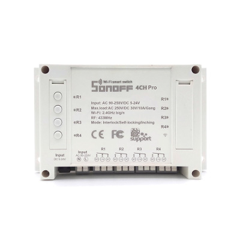

# Itead Sonoff 4CH

|Property|Value|
|---|---|
|Manufacturer|Itead Studio|
|Product page|[https://www.itead.cc/sonoff-4ch-pro.html](https://www.itead.cc/sonoff-4ch-pro.html)|
|Wiki page|[https://www.itead.cc/wiki/Sonoff](https://www.itead.cc/wiki/Sonoff)|
|Build flag|`ITEAD_SONOFF_4CH_PRO`|

## Introduction

The iTead Sonfoff 4CH Pro and 4CH Pro R2 are 4 channel multi-function relay boards. They support switching among 3 working modes: interlock/self-locking/inching mode. 4CH Pro supports to set 0.25-4s delay in inching mode, R2 supports 1-16s delay. The 4CH boards can use and power both AC and DC devices. 
Specification
•	Voltage Range: 90-250V AC(50/60Hz) / 5-24V DC
•	Max Current: 10A/gang
•	Max Power: 2200W/gang
•	Gang: 4

## Flashing

GPIO0 is not connected to anything on the 4CH Pro, the R2 has a pad broken out. To flash, connect GPIO0 to gnd when powering on. (need verification here on the 4ch pro. On my R2 it was on power, but have seen rumors of 3s delay)

## Issues

There is a secondary chip that forwards commands to the main ESP8285. Recommended configuration is to use self-locking mode for all 4 channels (S6 to 1 and K5 to 1111) if you need this to operate like a normal ON/OFF switch.