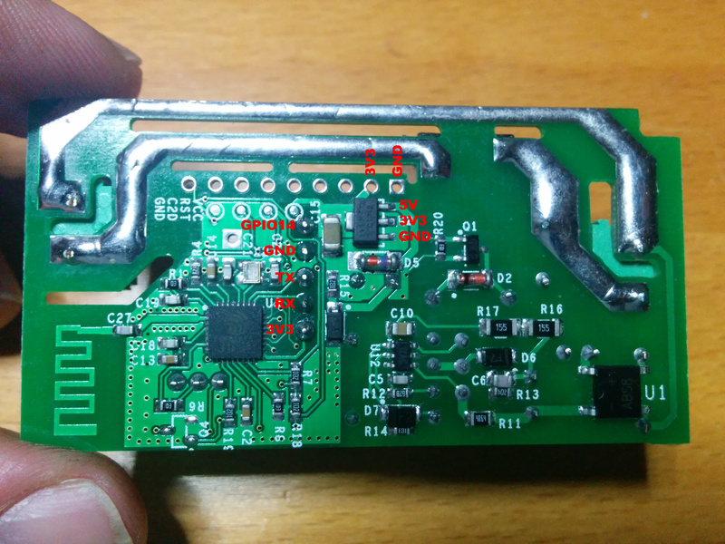

# Itead Sonoff Basic

|Property|Value|
|---|---|
|Manufacturer|Itead Studio|
|Product page|[https://www.itead.cc/sonoff-wifi-wireless-switch.html](https://www.itead.cc/sonoff-wifi-wireless-switch.html)|
|Wiki page|[https://www.itead.cc/wiki/Sonoff](https://www.itead.cc/wiki/Sonoff)|
|Build flag|`ITEAD_SONOFF_BASIC`|

## Introduction

The original Sonoff (now renamed Sonoff Basic) has an ESP8266 on board with a 8Mbit flash memory chip, a mains to 3V3 transformer and a relay (GPIO12). It also features a button (GPIO0), an LED (GPIO13) and an unpopulated header you can use to reprogram it.

|GPIO|Usage|
|---|---|
|0|Main button|
|1|TX|
|3|RX|
|12|Relay|
|13|LED (inversed logic)|
|14|Available in header|

## Flashing

The unpopulated header in the Sonoff has all the required pins. My board has a 5 pins header in-line with the button. They are (from the button outwards) 3V3, RX, TX, GND and GPIO14.

The last one is not necessary.  The button is connected to GPIO0 on the ESP8266 chip, so to enter flash mode you have to hold the button pressed while powering on the board, then you can release it again.

## Issues

The original Sonoff has some connectivity issues. This is probably due to the antenna placement close to live lines. It works fine if it's near the AP, otherwise, it's often reported to lose connectivity.
