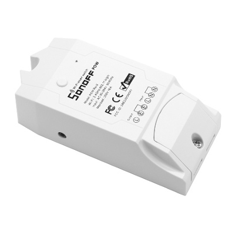

# Itead Sonoff POW R2

|Property|Value|
|---|---|
|Manufacturer|Itead Studio|
|Product page|[https://www.itead.cc/sonoff-pow-r2.html](https://www.itead.cc/sonoff-pow-r2.html)|
|Wiki page|[https://www.itead.cc/wiki/Sonoff](https://www.itead.cc/wiki/Sonoff)|
|Build flag|`ITEAD_SONOFF_POW_R2`|
|Voltage|3v3|

## Introduction

Unlike the original POW, the new POW R2 uses a CSE7766 (sometimes a CSE7759b) power monitor chip. This chip is supported by ESPurna but uses the hardware UART, so there is no serial debug monitor when using the R2 (you can still use the web debug or telnet).

[iTead Sonoff Pow R2 with Energy Monitoring](http://sonoff.itead.cc/en/products/sonoff/sonoff-pow-r2)

## Flashing

The unpopulated header in the Sonoff has all the required pins. My board has a 4 pins header. They are (from the top down) 3V3, E-RX, E-TX and GND. The button is connected to GPIO0, so all you have to do is to power the power the board while pressing the button to get into flash mode.