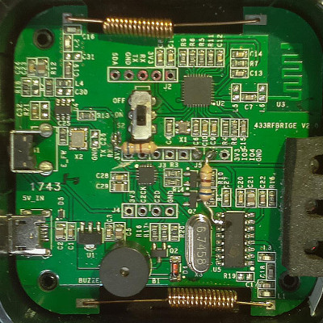
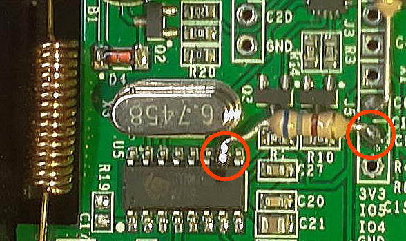
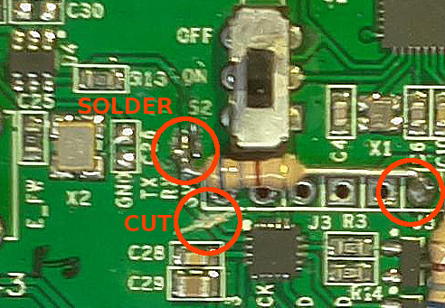

Many thanks to [**@wildwiz**](https://github.com/wildwiz) for documenting and develop the necessary code for this modification.

> NOTE: this hack requires soldering and cutting traces. Once you do it it will be hard to reverse (although not impossible). You will also lose the beeping notification from the device when in learning mode. On the other side, the device capabilities will be increased since the firmware will be able to handle the encoding/decoding itself and that means more remotes will be supported.

This mod provides for the recognition of a wider set of remote control codes than those natively handled by the EFM8B1 auxiliary microcontroller inside the sonoff bridge. The EFM8B1 microcontroller (at the center of the image, just under the switch) is entirely bypassed, allowing the ESP8266 to take care of decoding and decoding the RC pulses in a more flexible way.

## Software

This mod requires a ESPurna to be compiled using the **RFB_DIRECT** setting set to 1, so it is aware that we have to encode/decode the signals in software rather than talk to the microcontroller. 

## Hardware modifications

### Receiver signal rewiring

The output of the UHF receiver, pin 10, is routed directly to the unused GPIO4 pin of the ESP8266, which is exposed on one of the connectors. The original connection between the UHF receiver and the EFM8B1 microcontroller is left unchanged.

### Transmitter signal rewiring

The EFM8B1 microcontroller MUST be excluded from the signal path cutting the trace as shown. The tx signal is generated directly on the GPIO5 pin of the ESP8266 and routed to the transmitter in place of the signal from EFM8B1.

### Notes

The connections can be made either with simple wire or (recommended) with a resistor (anything in the range 180-680 ohms, 1/4 1/8 W will do). The advantage of using a resistance is that if you inadvertently solder the wrong pins, the resistor will prevent any damage to the semiconductors. This is especially true for the TX side of the transmitter modification, as the track where to solder the resistor is really very thin and it is easy to short the connection to ground by mistake.

