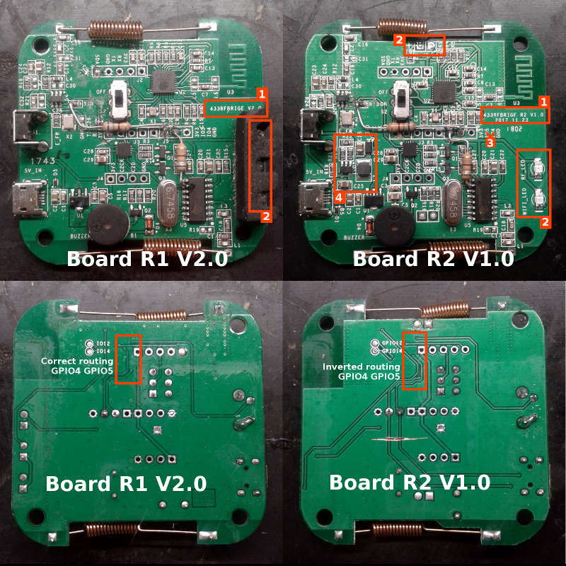
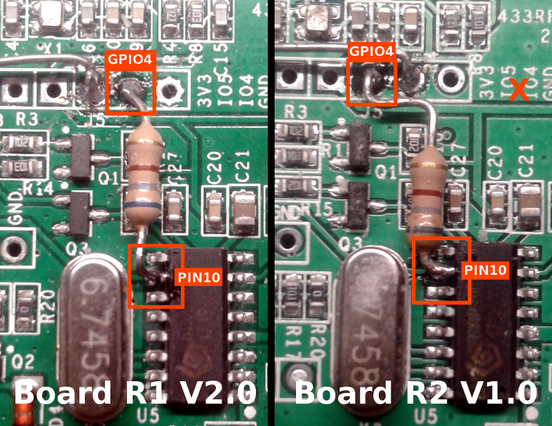
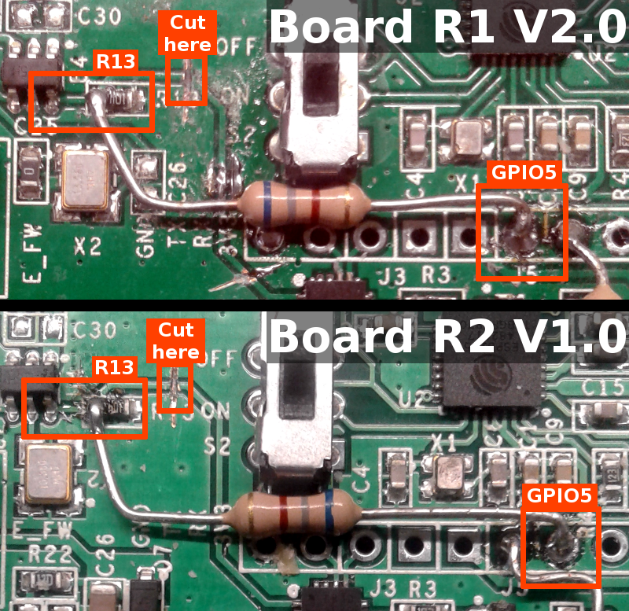
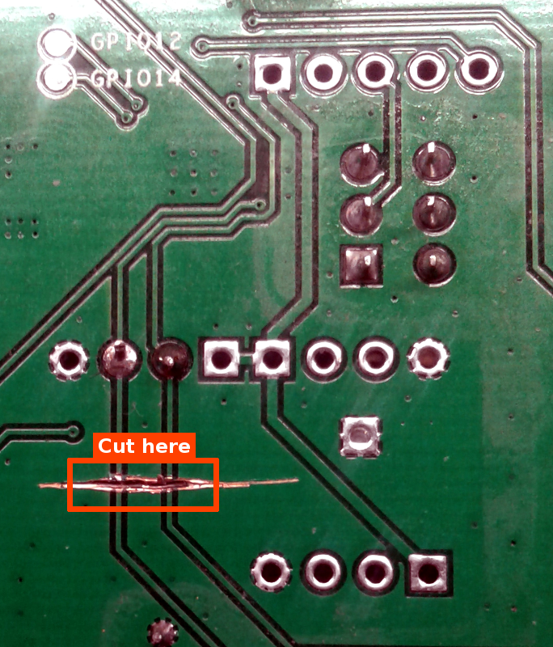

> NOTE: this article is being updated. If you don't see the images, [temporary follow this link](https://github.com/wildwiz/espurna/wiki/Hardware-Itead-Sonoff-RF-Bridge---Direct-Hack)

Many thanks to [**@wildwiz**](https://github.com/wildwiz) for documenting and developing the necessary code for this modification.

> NOTE: this hack requires soldering and cutting traces. Once you do it it will be hard to reverse (although not impossible). You will also lose the beeping notification from the device when in learning mode. On the other side, the device capabilities will be increased since the firmware will be able to handle the encoding/decoding itself and that means more remotes will be supported.

|Property|Value|
|---|---|
|Build flags|`ITEAD_SONOFF_RFBRIDGE, RFB_DIRECT=1`|

This upgrade provides for the recognition of a wider set of remote control codes than those natively handled by the EFM8B1 auxiliary microcontroller inside the sonoff bridge. The EFM8B1 microcontroller is entirely bypassed, allowing the ESP8266 to take care of decoding and decoding the RC pulses in a more flexible way.

# Software

This upgrade requires a ESPurna to be compiled using the setting `RFB_DIRECT=1` (available since 1.12.6), so that the firmware is aware that we have to encode/decode the signals in software rather than talk to the EFM8B1 microcontroller. 

The specific firmware, is available as **_espurna-`x.x.x`-itead-sonoff-rfbridge-`direct`.bin_** under https://github.com/xoseperez/espurna/releases. This firmware will work ONLY if the hardware modification below has been applied. An unmodified sonoff board it will receive nothing from the remote.

# Hardware modifications

## Detect the type of your board

Currently there are two types of board on the market. 
 It is important that you recognize the type of your board, or your modification will not work.

### BOARD R1 V1.0 and BOARD R1 V2.0
First generation boards (marked either "433RFBRIDGE V1.0" or "433RFBRIDGE V2.0") (see marking **[1]** on the picture) can be recognized by the three 3mm leds on the side (see marking **[2]** on the picture. From top to bottom the leds are RF(red), WIFI(blue), POWER(green)

### BOARD R2 V1.0
Second generation boards (marked "433RFBRIDGE R2 V1.0") (see marking **[1]** on the picture) can be recognized by the smd leds on the side and the prismatic led under sonoff logo on the cover (see marking **[2]** on the picture). On top edge there is the POWER(green) prismatic led, while on the right edge there are, top to bottom, the smd leds, RF(red), WIFI(blue). 

The power led has been removed in the pictures to expose the area to be modified. In practice, you just need to lift the led and temporary bend it vertically, without need to remove it. 

**_IMPORTANT!: The R2 boards have a bug in PCB routing that swaps the GPIO4 and GPIO5 pins (see marking [3]). The silkscreen on this board is WRONG as the names for IO4 and IO5 are swapped._**

The R2 boards feature a boost inverter to raise the power supply of the RF transimtter, improving the transmit distance of the bridge.

## Apply the hardware changes

### Receiver signal rewiring

The output of the UHF receiver, pin 10, is routed directly to the GPIO4 pin of the ESP8266, which is exposed on one of the connectors. The original connection between the UHF receiver and the EFM8B1 microcontroller is left unchanged. Depending on the type of your board, the pin for GPIO4 may be either the 2nd or the 3rd from ther right in the connector holes. 

It is recommended to use a resistor to connect GPIO4 and pin 10 of the UHF receiver (see notes below)

**_IMPORTANT: DO NOT TRUST the markings IO4 IO5 on the board, use the pin indicated in the image for your board type._**

### Transmitter signal rewiring

The tx signal is generated directly on the GPIO5 pin of the ESP8266 and routed to the transmitter in place of the signal from EFM8B1.

The EFM8B1 microcontroller MUST be excluded from the signal path cutting the trace as shown, otherwise there will be a conflict between the EFM81B microcontroller output and the GPIO5 output, possibly damaging one of both chips.

It is recommended to use a resistor to connect GPIO5 and R13 on the UHF transimtter (see notes below)

**_IMPORTANT: DO NOT TRUST the markings IO4 IO5 on the board, use the pin indicated in the image for your board type._**

### USB data lines (ONLY FOR R2 BOARDS)

**ONLY for R2 boards:** The R2 boards connect pins GPIO4 and GPIO5 to the usb data lines of the power connector. Compliant USB chargers/power supply are expected to short the two pins together, which is no good for the modifications applied. These lines are not used by the original firmware, nor by espurna.

The traces toward the usb connector need to be cut to avoid interference by the USB wiring. 

# Notes

## Connections

The connections can be made either with simple wire or (recommended) with a resistor (anything in the range 180-680 ohms, 1/4 1/8 W will do). The advantage of using a resistance is that if you inadvertently solder the wrong pins, the resistor will prevent any damage to the semiconductors. This is especially true for the TX side of the transmitter modification, as the track where to solder the resistor is really very thin and it is easy to short the connection to ground by mistake.

## Cutting traces

The easiest way to cut traces is with the corner/edge of small flat screwdriver. A cutter will do too, but with a screwdriver you can apply more force. Be careful to obtain a clean cut, without leaving copper shorting either side of the cut line with the adjacent ones. If the cut is not deep enough, you will just smear the copper and short the trace with the adjacent ones.
