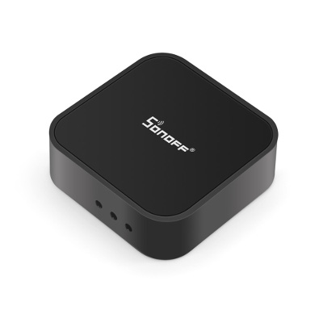
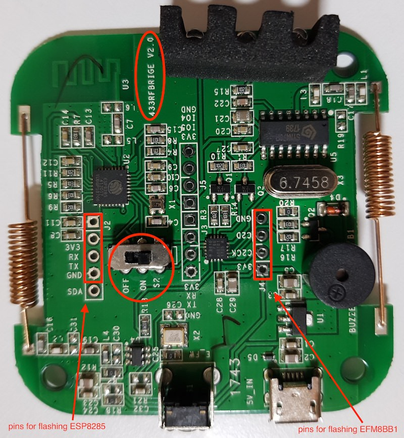

# Itead Sonoff RF Bridge

|Property|Value|
|---|---|
|Manufacturer|[Itead Studio](https://www.itead.cc)|
|Product page|https://www.itead.cc/sonoff-rf-bridge-433.html|
|Wiki page|https://www.itead.cc/wiki/Sonoff_RF_Bridge_433|
|Build flag|`ITEAD_SONOFF_RFBRIDGE`|

## Introduction

Here is the original post on sonoff rf bridge: 
http://tinkerman.cat/hacking-sonoff-rf-bridge-433

## Modifications

ESPurna supports two hacked variants of the Sonoff RFBridge:
* [RF_RAW_SUPPORT](https://github.com/Portisch/RF-Bridge-EFM8BB1) based on custom EFM8 firmware 
* [RFB_DIRECT](https://github.com/xoseperez/espurna/wiki/Hardware-Itead-Sonoff-RF-Bridge---Direct-Hack) hack that bypasses the EFM8 microcontroller and lets ESPurna handle the encoding/decoding
## Flashing

## Issues

*TODO*