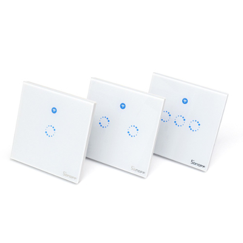
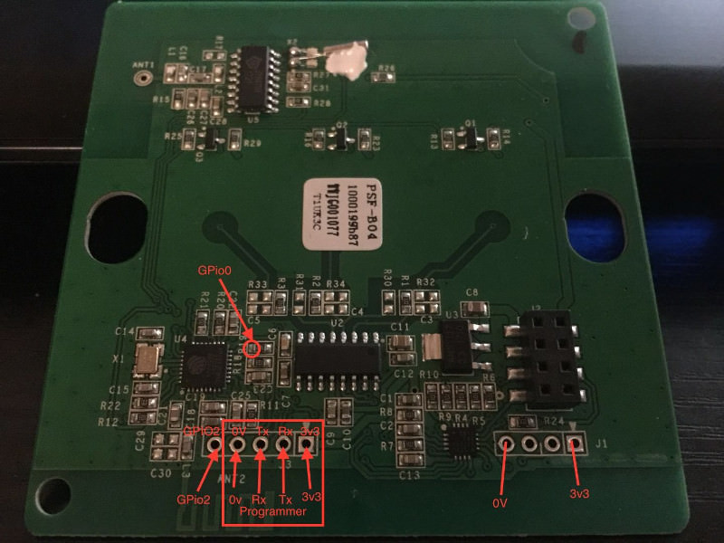
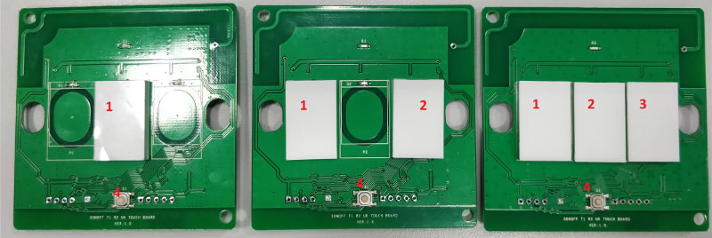

# Itead Sonoff T1



|Property|Value|
|---|---|
|Manufacturer|Itead Studio|
|Web page|[https://www.itead.cc/sonoff-t1.html](https://www.itead.cc/sonoff-t1.html)|
|Wiki page||
|Build flag|`ITEAD_SONOFF_T1_1CH` <br> `ITEAD_SONOFF_T1_2CH` <br> `ITEAD_SONOFF_T1_3CH`|

## Introduction

The Sonoff T1 is a panel switch with touch control that comes in three "flavours": one gang, two gangs and three gangs. Its the evolution of the Sonoff Touch and includes a 433MHz receiver driven by a EFM8BB1 like the Sonoff RF or the Slampher. Pairing a remote is done the same way as with those two. Press and hold any of the touch buttons until the unit double beeps and then press the desired button in your remote.

The devices comes in EU, UK and USA versions that differ in the form factor. Each gang is a SPST relay, thus no 3-way switching is available with the original configuration. You can, of course, use a 2CH to simulate a 3-way switch using the synchronizing feature in ESPurna.

|GPIO|1CH|2CH|3CH|
|---|---|---|---|
|0|Button #1|Button #1|Button #1|
|1|TX|TX|TX|
|2|Available in header|Available in header|Available in header|
|3|RX|RX|RX|
|4|||Relay #3|
|5||Relay #2|Relay #2|
|9||Button #2|Button #2|
|10|||Button #3|
|12|Relay #1|Relay #1|Relay #1|
|13|LED (inversed logic)|LED (inversed logic)|LED (inversed logic)|

## Flashing




To enter flashing mode the main board should be disconnected from the rear relay to prevent power drain that will cause the ESP to reset often while flashing. Then connect your programmer to the 4-pin header (use 3V3!!!). To enter flash mode button 1 (check pictures above) should be held while reset button (number 4 in picture above) is pressed. Once in flash mode you can release button 1.

## Issues

Since it uses touch panel the best experience requires a different approach to button definitions. This is the definition for button 1 for Sonoff T1, as you see the event is fired on press (not on release) and most of other events are disabled.

```
#define BUTTON1_MODE        BUTTON_PUSHBUTTON | BUTTON_DEFAULT_HIGH
#define BUTTON1_PRESS       BUTTON_MODE_TOGGLE
#define BUTTON1_CLICK       BUTTON_MODE_NONE
#define BUTTON1_DBLCLICK    BUTTON_MODE_NONE
#define BUTTON1_LNGCLICK    BUTTON_MODE_NONE
#define BUTTON1_LNGLNGCLICK BUTTON_MODE_RESET
```
