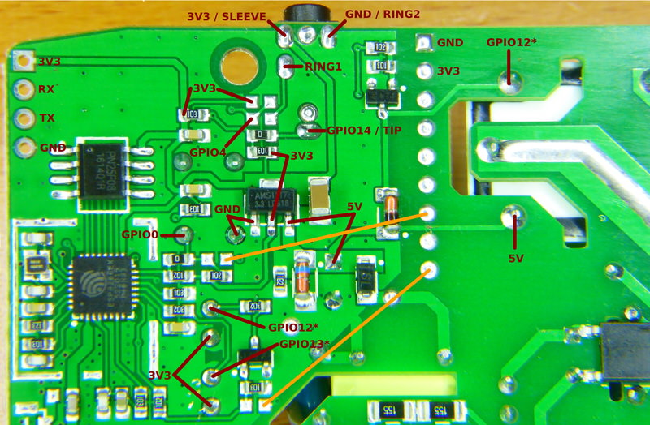

# Itead Sonoff TH

|Property|Value|
|---|---|
|Manufacturer|Itead Studio|
|Web page|[https://www.itead.cc/sonoff-th.html](https://www.itead.cc/sonoff-th.html)|
|Wiki page|[https://www.itead.cc/wiki/Sonoff_TH_10/16](https://www.itead.cc/wiki/Sonoff_TH_10/16)|
|Build flag|`ITEAD_SONOFF_TH`|

## Introduction

The Sonoff TH includes a 2.5mm jack on the side. The jack is a TRRS connector (tip-ring-ring-sleeve) that accepts, besides VCC and GND, two data lines. The original device only exposes GPIO14 through this interface but on the board there are pads to add the required components (two resistors) to bring out GPIO4 as well. With two digital GPIOs you can do a lot of things, including connecting I2C sensors. Check my post [Sonoff TH10 and TH16 - Sensors, Displays and Actuators] (http://tinkerman.cat/sonoff-th10-th16-sensors-displays-actuators/) for more info.

Itead sells several sensors with this 2.5mm interface: an AM2301, a SI7021 (with a microcontroller that makes it have the same interface as the AM2301) and a DS18B20.

It also looks like ready to have an RF module the same way as the Sonoff RF, but there is no footprint for a EFM8BB1 so maybe the idea was to drive it directly from the ESP8266. There are (disabled) traces that connect the module with GPIO0 (button) and GPIO12 (relay).

|GPIO|Usage|
|---|---|
|0|Button|
|1|TX|
|3|RX|
|4|Available in 2.5mm jack (requires hardware modifications)|
|12|Relay|
|13|LED (inversed logic)|
|14|Available in 2.5mm jack|

## Flashing

You have all the required pins in an unpopulated header in one of the corners of the board (see top left corner in the image above). Solder a 4 pins male or female header here and connect it to your favorite USB-to-UART module.

As in the Sonoff the button is connected to GPIO0, so to enter flash mode press and hold the button and connect the programmer to your computer to power the board.
