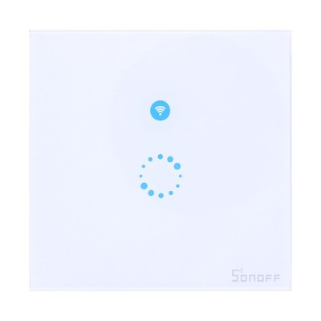

# Itead Sonoff Touch

|Property|Value|
|---|---|
|Manufacturer|Itead Studio|
|Product page|[https://www.itead.cc/sonoff-touch.html](https://www.itead.cc/sonoff-touch.html)|
|Wiki page|[https://www.itead.cc/wiki/Sonoff](https://www.itead.cc/wiki/Sonoff)|
|Build flag|`ITEAD_SONOFF_TOUCH`|
|Voltage|3v3|

## Introduction

*TODO*

## Flashing

The Sonoff Touch is a bit tricky to flash since GPIO 0 is not connected to the button as in the TH or POW. So you have to locate the pad for GPIO 0 and short it to ground while powering on the device, once it is on in
flash mode you can remove the GND connection.

The picture above shows the location of the GPIO 0 pad. The other required pins are available on the header at the top which has to be soldered in the existing slots.

Once flashed you can use OTA to update the firmware without having to open the device.

## Issues

The original Sonoff has some connectivity issues. This is probably due to the antenna placement close to live lines. It works fine if it's near the AP, otherwise, it's often reported to lose connectivity.
