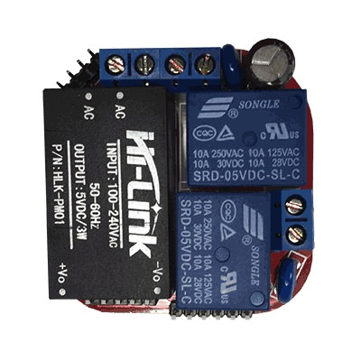

# JanGoe Wifi Relay Board

|Property|Value|
|---|---|
|Manufacturer|JanGoe|
|Product page|[https://github.com/JanGoe/esp8266-wifi-relay](https://github.com/JanGoe/esp8266-wifi-relay)|
|Wiki page||
|Build flag|`JANGOE_WIFI_RELAY_NC` or `JANGOE_WIFI_RELAY_NO`|
|Voltage|5v|

## Introduction

*TODO*

## Flashing

Connect GPIO0 to GND in the bottom-left header in the picture above and then connect your USB-to-UART programmer to the top-left corner header.

## Issues

*TODO*