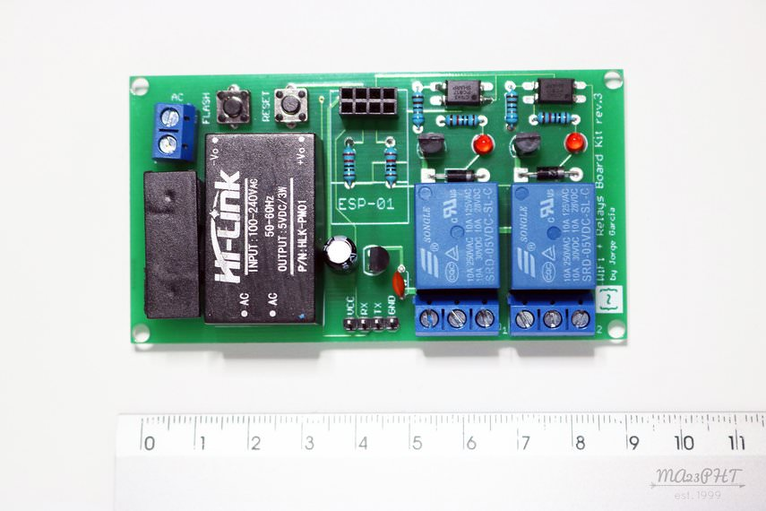

# Jorge García Wifi Relays Board Kit

|Property|Value|
|---|---|
|Manufacturer|Jorge García|
|Product page|[https://www.tindie.com/products/jorgegarciadev/wifi--relays-board-kit](https://www.tindie.com/products/jorgegarciadev/wifi--relays-board-kit)|
|Wiki page||
|Build flag|`JORGEGARCIA_WIFI_RELAYS`|
|Voltage|5V|

## Introduction

*TODO*

## Flashing

You have all the required pins in an unpopulated header between the relays and the transformer. Solder a 4 pins male or female header here and connect it to your favorite USB-to-UART module. The VCC pin should be connected to 5V.

Press and hold the "Flash" button and then press and release the "Reset" button. You are now in flash mode and ready to upload the firmware image.

## Issues

*TODO*