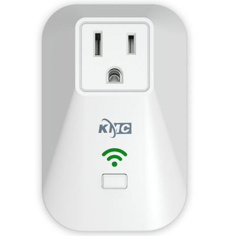

# KMC 70011

|Property|Value|
|---|---|
|Manufacturer|KMC|
|Product page|[Amazon Link](https://www.amazon.com/gp/product/B07313TH7B/ref=oh_aui_detailpage_o05_s00?ie=UTF8&psc=1)|
|Wiki page||
|Build flag|`70011`|

## Introduction

Max load: 10A, 2400W. 
Made by ABS flame resitance material. 
A built-in thermal sensor will automatically turn off overheating appliances, has encryption chip. 
Has power meter HLW8012

## Flashing
Hardware button is connected to GPIO 0, so soldering to that pad on the ESP-8266 module is completely optional. Users can just press the button while applying power to the device in order to put the device into flashing mode. 

*TODO*

## Issues

*TODO*