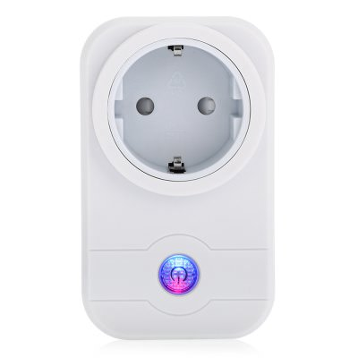
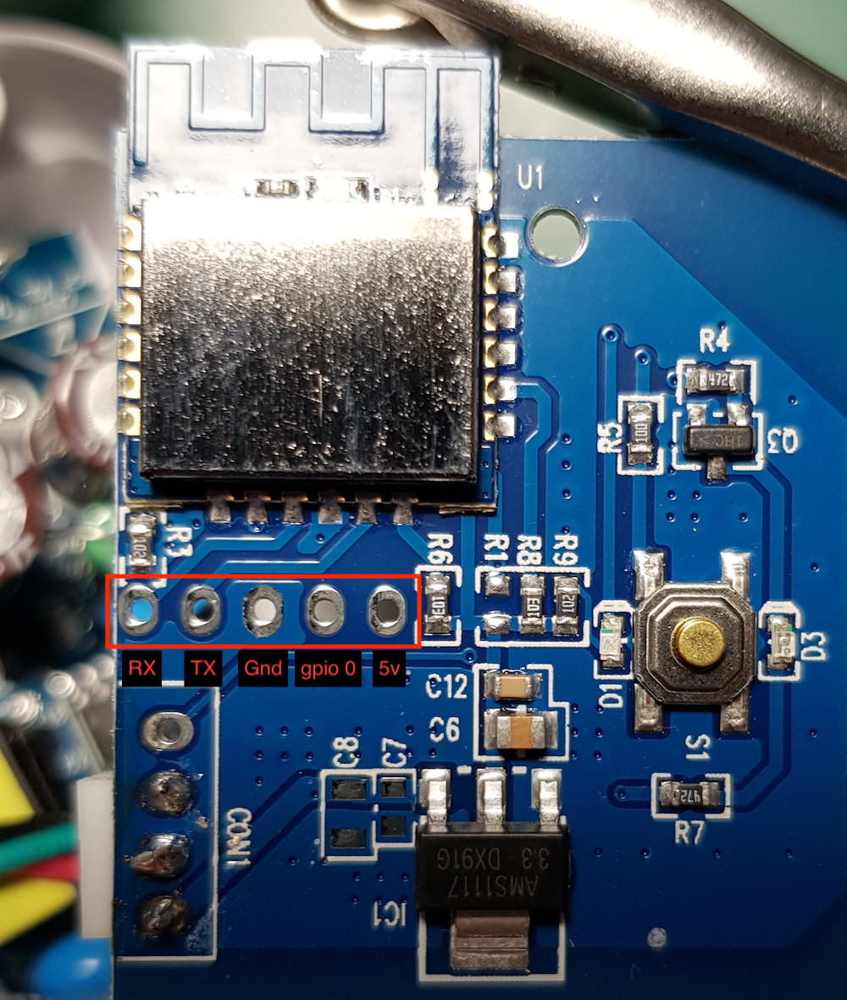

# LINGAN SWA1

|Property|Value|
|---|---|
|Manufacturer|LINGAN|
|Product page|[Aliexpress Link](https://www.aliexpress.com/item/US-EU-Plug-LINGAN-SWA1-Smart-Socket-2-4GHz-Wireless-Remote-Control-100-240V-2000w-Outlet/32822019108.html)|
|Wiki page||
|Build flag|`LINGAN_SWA1`|

## Introduction

* Rated voltage: AC 100-240V 
* Rated current: 10A (2000W)
* Product size: L10 x W6 x H4.30 cm

## Flashing

## Issues

*TODO*