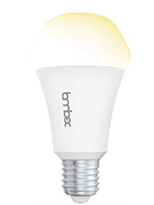

# Lombex Lux Nova smart bulb

|Property|Value|Property|Value|
|---|---|---|---|
|Manufacturer|Lombex|Manufacturer|Lombex|
|Product page|[Amazon](https://www.amazon.com/Lombex-Compatible-Equivalent-Automation-Dimmable/dp/B07B3R9NR3)|Product page|[Amazon](https://www.amazon.com/Lombex-Compatible-Equivalent-Automation-Dimmable/dp/B07B3R9NR3)|
|Wiki page||Wiki page||
|Build flag|`LOMBEX_LUX_NOVA2_TUNABLE_WHITE`|Build flag|`LOMBEX_LUX_NOVA2_WHITE_COLOR`|
|Voltage|3v3|Voltage|3v3|

## Introduction

Lombex Lux Nova is a line of smart bulbs that includes:

|Bulb Name|Channels|
|---|---|
|Nova 1 White and Color|RGB/WW|
|Nova 2 White and Color|RGB/CW?|
|Nova 2 Simply White|WW|
|Nova 2 Tunable White|CW/WW|

All of the bulbs use an ESP8266 and MY9291 LED driver. The bulb itself does not have any reliable distinguishing marks (it may have a model number, but it is shared between all of these similar bulbs).

## Flashing

There are three PCBs connected together at their edges with solder. The LED PCB, the ESP module, and the main board which contains the MY9291 chip and the power supply.

Pop out the bulb head to access the LED PCB. The LED PCB is secured to the heat sink with two screws. Unscrew the PCB, but **DO NOT ATTEMPT TO PRY THE BOARD UP**. Prying will put stress on the 5 solder joints that connect the main board to the LED board. Instead I recommend desoldering the LED board to reveal some of the main board and ESP module. Be careful to preserve the thermal compound underneath the LED board.

On the Nova 2 bulbs, most of the assembly is potted with a gray soft potting compound. It is a little messy, but it can be cut and dug at with a flathead screwdriver or a hobby knife. Dig out the edge connection between the ESP module and the main board and solder wires to the 4 joints on the mostly blank side of the ESP module (without the antenna). The pinout (from inside the bulb to outside) is VCC, GND, RX, TX. The other side is GPIO5, GPIO4, GPIO15, TOUT. It may be just about under the surface of the potting compound, but you can also find pads marked IO_0, IO_2, and RST on the mostly blank side of the ESP module. Solder another wire to IO_0.

From there you can flash as normal. Connect the wires to an FTDI (or alike) board that supplies 3.3V on VCC. TX to RX and RX to TX. Connect GND and IO_0 to ground and finally 3V3. Once you plug your programmer to the computer the board will boot into flash mode. While you are flashing it you can remove the IO_0 connection. Upon reboot it will enter normal mode and you should see the debug messages in the screen.

## Notes

If you want less tricky soldering, alternatively you may be able to lift the assembly up without desoldering the LED board by grabbing the top of the ESP module with pliers (wrap in paper to avoid damaging the antenna). From there you can rip out all of the potting compound if you wish. Be aware that in the bottom section below the compound there is actually sand. So you will likely need to vacuum out or use an air compressor on it, and you will likely make a mess all over the thermal compound and have to clean/replace that as well. But you can avoid desoldering the LED board, and have easier access to the ESP module edge connection.

On the main board across from the ESP edge are spots for 4 resistors corresponding to the 4 channels from the MY9291 chip. On the tunable white model, two are unpopulated (as it only needs two channels). Two resistors can be added to add support for the missing channels, and the LED boards are fairly interchangeable between models of this bulb.

The Nova 2 White and Color manufacturer firmware employs a sliding scale between supposedly cool and warm ends similar to the tunable white model despite the lack of two separate white LED sets. It does this by setting the RGB LEDS a little bit orange to make the light appear warmer toward that end of the scale. However there appears to be a defect, unknown how widespread, as the bulbs I myself received use warm LEDs to begin with. Given the sliding scale feature and the product description, they are almost certainly supposed to be cool. The current build assumes cool leds as the fourth channel. If your bulb uses warm leds keep this in mind as features like "Use white channel" might look weird.

The RGB LEDs on equal power to each channel produce a very cool blue light. It may be possible to use that as the cool end of the scale against the warm LEDs. See note in issues section before attempting however.

## Issues

**WARNING: IT IS POSSIBLE TO BREAK THE BULB IN SOFTWARE.**
The manufacturer firmware typically only allows one set of LEDS at full power at one time. For example in the White and Color models colors can be on on full blast, but not at the same time as white. (With one exception of a warm light hack, see notes).
Espurna allows for pushing every channel at once to full blast, which may stress the bulb's power supply and heat dissipation capabilities. Leaving too many channels on full for an extended period could result in a broken bulb. Therefore it is recommended to use only color or white capabilities at one time. Or at least not both full blast at the same time.

On the tunable model in the manufacturer firmware, there is a sliding scale between cool and white, but the total power between them can't go above the amount of power for one of them at full blast. i.e. if cool white is at 1/4 power, warm white is at 3/4 power. This mimics the "color temperature" feature in Espurna, and it is recommended to enable and use this feature rather than controlling the channels directly.
