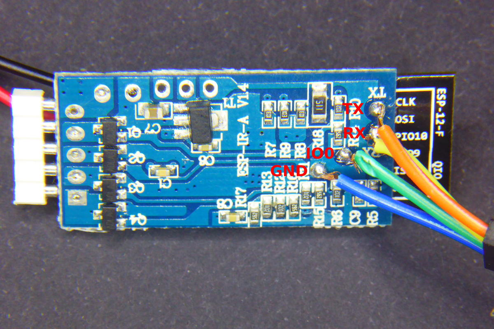

# Magic Home LED Controller

|Property|Value|
|---|---|
|Manufacturer|Magic Home|
|Product page|[Magic Home LED Controller at Aliexpress](http://s.click.aliexpress.com/e/VNnYVjE)|
|Wiki page|[Tinkerman Magic Home Led ESPurna'd](http://tinkerman.cat/magic-home-led-controller-espurnad/)|
|Build flag|`MAGICHOME_LED_CONTROLLER`|
|Voltage|Use power supply|

## Introduction

This is a small controller for RGBW 5050 LED strips, the kind of strips that show just one color on all the LEDs at the same time (no WS2812 controller). It has what looks like to be an ESP-12E module but it's not. My board reports being a generic 1MB ESP8266 module with QIO flash mode but other user's have reported it to be connected in DIO configuration like a ESP8285.

## Flashing

Some thin tip soldering is required here. Check the picture above to solder 4 wires to the exposed pads. Then connect those wires to your programmer. RX and TX crossed and IO0 to GND to enter flash mode on boot. Then power the board through the built in 2.1mm jack.

Picture by user [Soif](https://bitbucket.org/soif/).

Version 2.0 of the board is different. Solder the 4 wires on the module (GND to GND, RX to TX in your USB2UART and TX to RX and GPIO0 to GND), then power the board via the 12V connector.

## Issues

*TODO*
