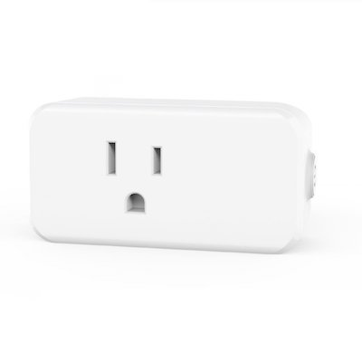
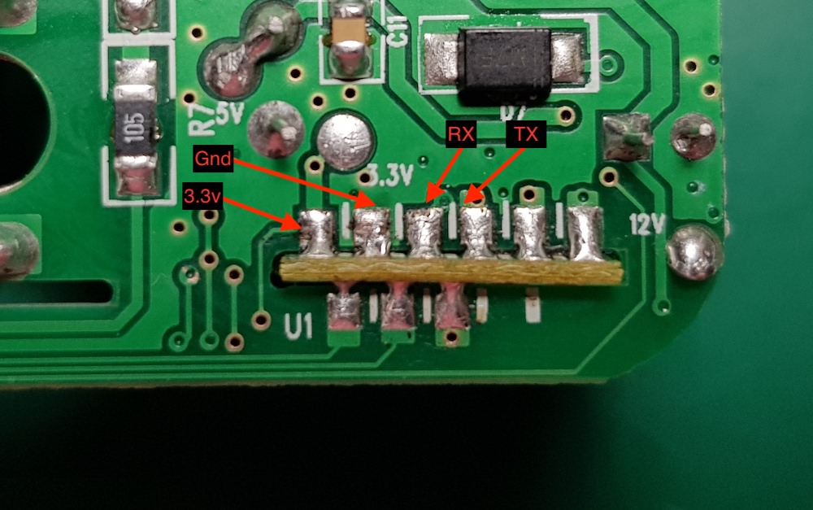
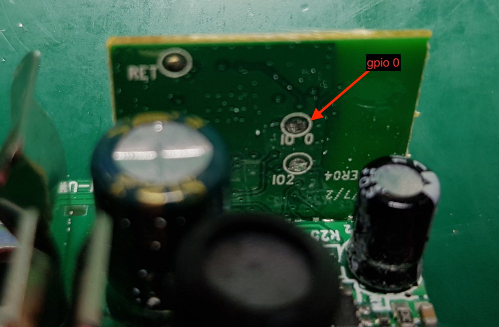
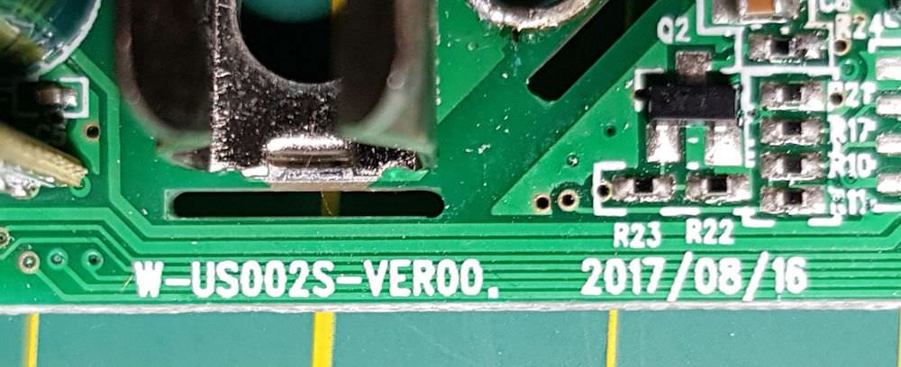

# Maxcio W-US002S

|Property|Value|
|---|---|
|Manufacturer|Maxcio|
|Product page|[Amazon Link](https://www.amazon.com/gp/product/B075QG95NX/ref=oh_aui_detailpage_o05_s00?ie=UTF8&psc=1)|
|Wiki page||
|Build flag|`MAXCIO_WUS002S`|

## Introduction

* Input voltage: AC100-240V 50/60Hz
* Working Current: 15A
* Has power meter HLW8012
* Power consuming: ≤0.3W
* Dimensions L2.96 x W1.57 x H0.98"

## Flashing

## Issues

*TODO*