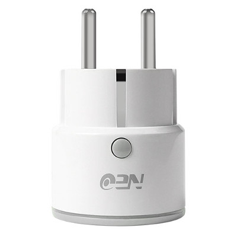
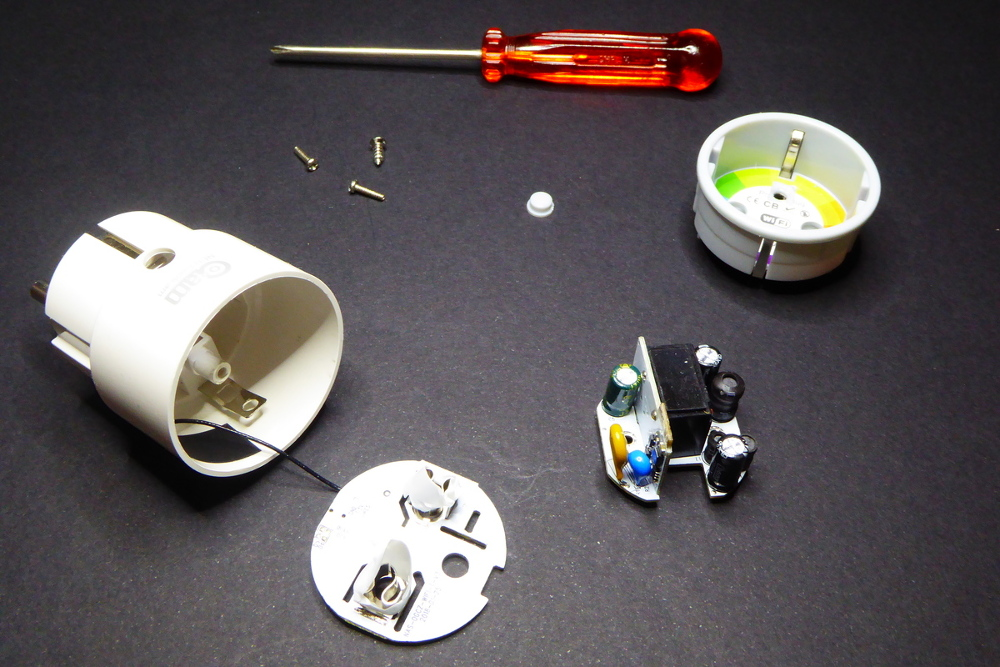
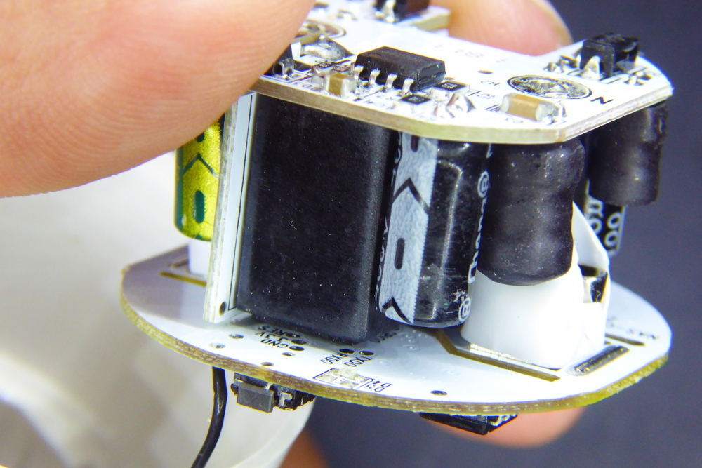
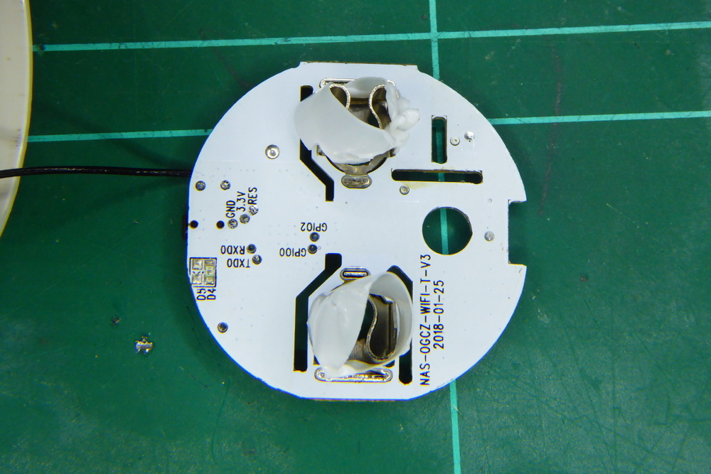

# NEO COOLCAM NAS WR01W

|Property|Value|
|---|---|
|Manufacturer|Coolcam|
|Product page|[AliExpress Link](https://www.aliexpress.com/item/NEO-COOLCAM-Wifi-Smart-Plug-EU-Socket-Support-Alexa-Google-Home-IFTTT-Outlet-With-Timer-and/32859702805.html)|
|Wiki page||
|Build flag|`NEO_COOLCAM_NAS_WR01W`|

## Introduction

* Rated voltage: AC 110-230V 
* Rated current: 10A (2300W)
* Product size: 65x43x43mm

## Flashing

Flashing the Neo Coolcam NAS WR01W is somewhat tricky. First it's got to be disassembled. 

The electronics are split into 3 different PCB for mains connection, power supply and logic. To be able to flash the ESP8266 chip you have to solder 5 small pads in the back of the top layer (the logic one), but those pads are hard to reach because the relay top (soldered to the bottom layer) is very close to them.

So the best option you have is to remove the top layer by desolder the 6 pads that connect it to the middle PCB. Once removed the procedure is the same as with other devices: tin the pads a bit, solder some small cables to it and flash it. The pads are appropiately labelled as GND, 3.3V, TXD0, RXD0 and GPIO0.

