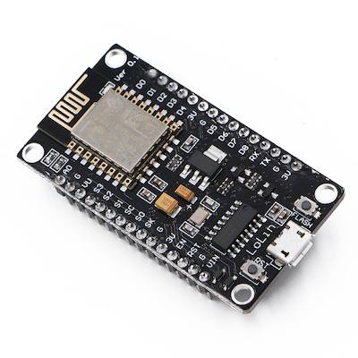

# NodeMCU Lolin

|Property|Value|
|---|---|
|Manufacturer|Lolin|
|Product page|[http://www.nodemcu.com/index_en.html](http://www.nodemcu.com/index_en.html)|
|Wiki page||
|Build flag|`NODEMCU_LOLIN`|
|Voltage|USB|

## Introduction

*TODO*

## Flashing

The NodeMCU has an microUSB port, can't be easier.

## Issues

*TODO*