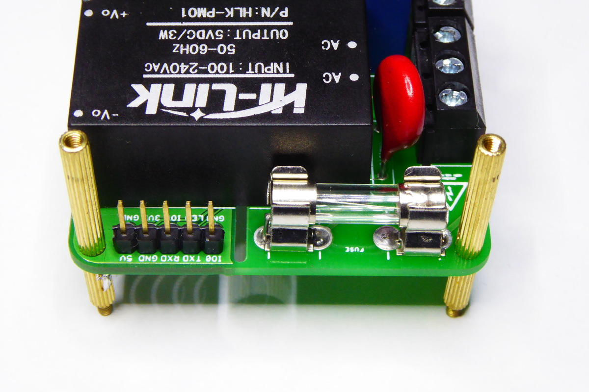

# Tinkerman's ESPurna H

|Property|Value|
|---|---|
|Manufacturer|Tinkerman|
|Product page|[ESPurna-H board at tinkerman.cat](http://tinkerman.cat/the-espurna-board-a-smart-wall-switch-with-power-monitoring/)|
|Wiki page||
|Build flag|`TINKERMAN_ESPURNA_H`|
|Voltage|5v|

## Introduction

Custom smart switch board that features:

* 50x50mm form factor that fits behind a standard wall switch here in Spain
* SPDT 10A relay with NO and NC connections brought out
* Connections for external button and notification LED
* HLW8012 chip for power monitoring

## Flashing

The board has a programming header with 5V (yes, not 3V3 but 5V), GND, TX, RX (remember to cross them to RX and TX in your programmer) and GPIO0. GPIO0 must be connected to GND when powering the board to enter flash mode.

## Issues

*TODO*