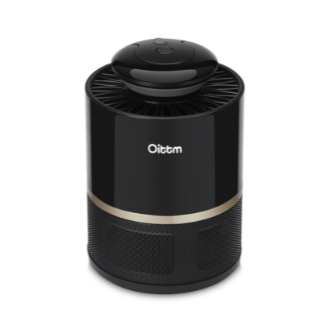
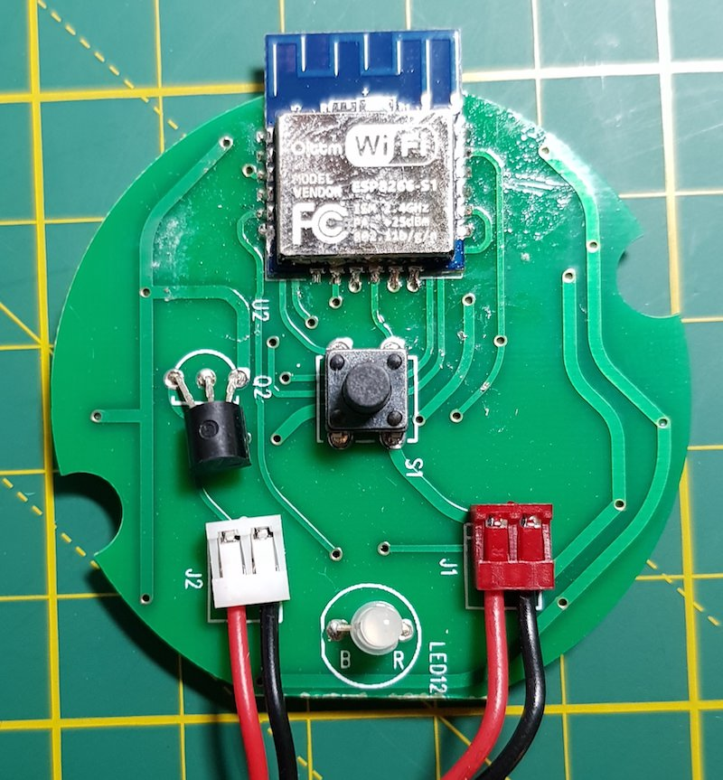
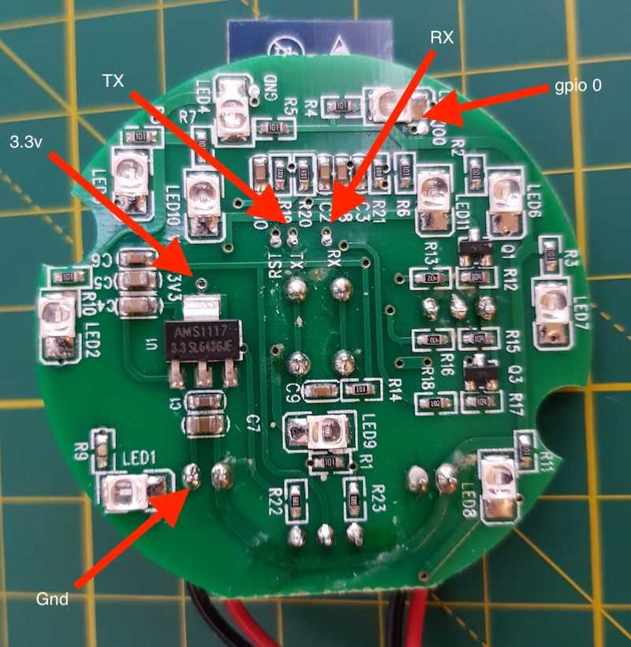
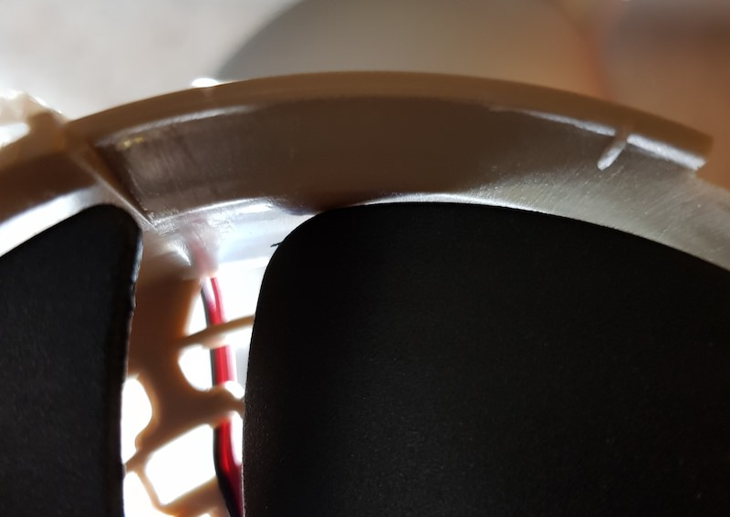

# TONBUX MOSQUITO KILLER

|Property|Value|
|---|---|
|Manufacturer|TONBUX / OITTM|
|Product page|[Aliexpress Link](https://www.aliexpress.com/item/Smart-USB-Mosquito-Killer-Light-50-100M-WiFi-Electric-Intelligent-Led-Lamp-No-Noise-Anti-Mosquito/32881785893.html)|
|Wiki page||
|Build flag|`TONBUX_MOSQUITO_KILLER`|

## Introduction
TONBUX MOSQUITO KILLER (model: MK02 WIFI Smart mosquito killer)

* Materials: Titanium steel + ABS
* Wavelength: 365mm
* Lamp type: LED
* Voltage: 100V-220V
* Output: 5V/1A
* Rated power: 3W

## Flashing

## Issues

When i received the item, fan was not working. After disassembling it, i noticed that one of the fan blades was touching the corner. It was more than a friction, it was basically stuck.

*TODO*