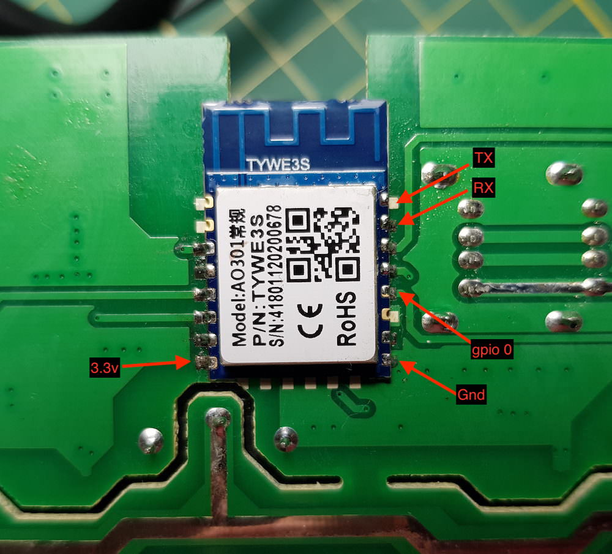

# Tonbux PowerStrip02

|Property|Value|
|---|---|
|Manufacturer|Tonbux|
|Product page|[Amazon Link](https://www.amazon.com/gp/product/B0779R4879/ref=oh_aui_detailpage_o02_s00?ie=UTF8&psc=1)|
|Wiki page||
|Build flag|`TONBUX_POWERSTRIP02`|

## Introduction

Size: 7.8”x 3.9” x 1.1” 
Power Cord Length: 5ft 
Outlet Voltage: AC110-240V 10A 
Rated Power: 1250W 
USB Max Output: 2.1A 
Material: ABS Flame-Retardant Polycarbonate 
 
4 AC Outlets + 4 USB Charging Ports 
(4 Outlets can be controlled individual, 4 USB ports are controlled as one) 
 
It seems it has support for HLW8012, but it's unpopulated.

## Flashing

## Issues

*TODO*