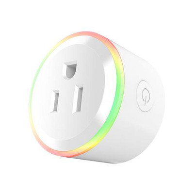

# Tonbux XS-SSA06

|Property|Value|
|---|---|
|Manufacturer|Tonbux (Generic)|
|Product page|[Aliexpress Search](https://www.aliexpress.com/wholesale?catId=0&initiative_id=SB_20180324043837&SearchText=XS-SSA06)|
|Wiki page||
|Build flag|`TONBUX_XSSSA06`|

## Introduction

* Working voltage: AC 100-240V
* Current: 10A (Max)
* Max Power: 1100w
* Product dimension: L50 * W50 * H55 mm
* RGB Led Ring

## Flashing

Board & Led Ring

## Issues

*TODO*