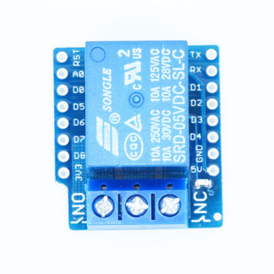

# Wemos D1 Mini Relay Shield

|Property|Value|
|---|---|
|Manufacturer|Wemos|
|Product page|[https://www.wemos.cc/product/relay-shield.html](https://www.wemos.cc/product/relay-shield.html)|
|Wiki page||
|Build flag|`WEMOS_D1_MINI_RELAYSHIELD`|
|Voltage|USB|

## Introduction

*TODO*

## Flashing

The Wemos D1 Mini has an microUSB port, can't be easier.

## Issues

*TODO*