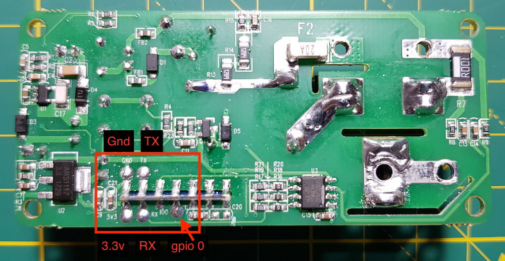

# YiDian XS-SSA05

|Property|Value|
|---|---|
|Manufacturer|YiDian|
|Product page|[Amazon Link](https://www.amazon.com/gp/product/B075ZQXWFZ/ref=oh_aui_detailpage_o05_s00?ie=UTF8&psc=1)|
|Wiki page||
|Build flag|`YIDIAN_XSSSA05`|

## Introduction

* Has power meter HLW8012
* Input voltage: AC100-240V 50/60Hz
* Max load current: 16A
* Max power: 1700W/3300W

## Flashing

## Issues

*TODO*