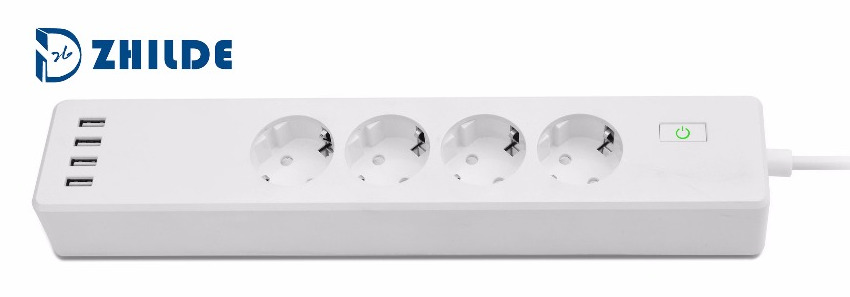
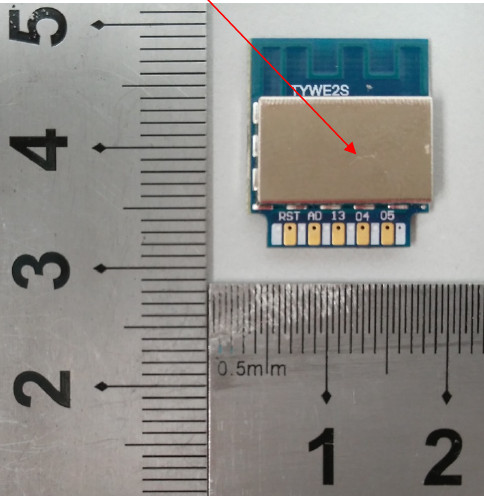
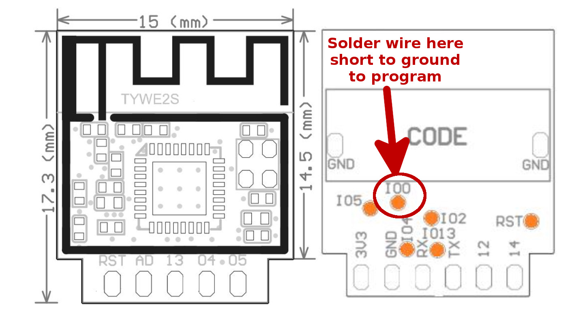

# Zhilde ZLD-44EU-W

|Property|Value|
|---|---|
|Manufacturer|[Zhilde](http://www.zhilde.com)|
|Product page|[Manufacturer page](http://www.zhilde.com/product/60705150109-805652505/EU_WiFi_Surge_Protector_Extension_Socket_4_Outlets_works_with_Amazon_Echo_Smart_Power_Strip.html)|
|Wiki page||
|Build flag|`ZHILDE_EU44_W`|

## Introduction

* Operating Voltage: AC 100~250V
* Rated Current: 10A
* USB Output 5V/4A
* Shell Material: ABS + PC 
* Dimensions: L334 * W64 * H40 mm 

## Flashing

The hardware is based on [Tuya's](https://docs.tuya.com/en/) ESP8285 based [TYW-E2S](https://docs.tuya.com/en/hardware/WiFi-module/wifi-e2s-module.html) WI-FI module, documented in   https://docs.tuya.com/en/hardware/WiFi-module/wifi-e2s-module.html  
(in the same website you find documentation for [TYW-E1S](https://docs.tuya.com/en/hardware/WiFi-module/wifi-e1s-module.html) and [TYW-E3S](https://docs.tuya.com/en/hardware/WiFi-module/wifi-e3s-module.html) as well)

Unfortunately the TYM-E2S does not expose GPIO0 on the edge connector. This pin is required to be strapped to ground to put the ESP8266/85 in bootstrap mode. 

There is a test pad on the back of the device, that needs to be temporary shorted to ground during programming. The other required pins are all available on the edge connector on the side with VCC and GND.

Note that once the espurna firmware is onboard, updates and changes can be done with the OTA feature of the firmware without phisically accessing the device again.

## Usage

The switches are mapped as follows:
* Switch 1 - socket closest to the power cord
* Switch 2 - 
* Switch 3 - 
* Switch 4 - socket closest to the USB connectors
* Switch 5 - powers/unpowers the USB power supply

The button does not command any of the relays, but it is active on extended/double click keypresses (reboot/reset to factory settings etc).

## Issues

(none known yet)