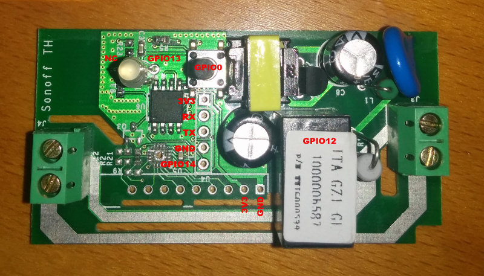
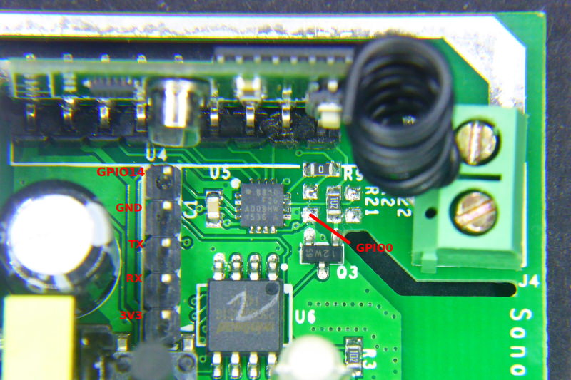

# Supported Hardware

This is the official list of supported hardware for the ESPurna firmware. The hardware configuration for each of these boards can be selected by supplying the build flag (see [Firmware section](Firmware.h)).

**CAUTION: Never ever connect any of these devices to your computer and to mains at the same time. Never ever manipulate them while connected to mains. Seriously. I don't want you to die. I hold no responsibility for any damage to you, your family, your house,... for any action or results derived from flashing or using these devices.**

* [Tinkerman's ESPurna H](tinkermans-espurna-h)
* [IteadStudio Sonoff Basic](iteadstudio-sonoff)
* [IteadStudio Sonoff RF](iteadstudio-sonoff-rf)
* [IteadStudio Sonoff TH10/16](iteadstudio-sonoff-th)
* [IteadStudio Sonoff POW](iteadstudio-sonoff-pow)
* [IteadStudio Sonoff DUAL](iteadstudio-sonoff-dual)
* [IteadStudio Sonoff 4CH](iteadstudio-sonoff-4ch)
* IteadStudio Sonoff 4CH Pro
* [IteadStudio Sonoff TOUCH](iteadstudio-sonoff-touch)
* IteadStudio Sonoff B1
* IteadStudio Sonoff T1
* IteadStudio Sonoff LED
* IteadStudio Sonoff 433 RF Bridge
* [IteadStudio Slampher](#markdown-header-iteadstudio-slampher)
* [IteadStudio Slampher 2.0](#markdown-header-iteadstudio-slampher-v20)
* [IteadStudio S20](#markdown-header-iteadstudio-s20-smart-socket)
* [IteadStudio 1CH Inching](#markdown-header-iteadstudio-1ch-inching)
* [IteadStudio Motor Clockwise/Anticlockwise](iteadstudio-motor-clockwiseanticlockwise)
* [IteadStudio Sonoff SV](iteadstudio-sonoff-sv)
* IteadStudio BN-SZ01
* [Electrodragon ESP Relay Board](electrodragon-esp-relay-board)
* [WorkChoice EcoPlug](workchoice-ecoplug)
* [Jan Goedeke Wifi Relay Board (NC/NO)](jangoe-wifi-relay-board)
* [OpenEnergyMonitor Wifi MQTT Relay / Thermostat](openenergymonitor-wifi-mqtt-relay-thermostat)
* [Jorge García Wifi + Relay Board Kit](jorge-garcia-wifi-relays-board-kit)
* [AI-Thinker AI Light / Noduino OpenLight](ai-thinker-ai-light-noduino-openlight)
* [Magic Home LED Controller](magic-home-led-controller)
* Huacanxing H801
* WiOn 50055
* EXS WiFi Relay v3.1
* [Wemos D1 Mini Relay Shield](wemos-d1-mini-relay-shield)

## IteadStudio Sonoff

|Property|Value|
|---|---|
|Manufacturer|Itead Studio|
|Web page|[https://www.itead.cc/sonoff-wifi-wireless-switch.html](https://www.itead.cc/sonoff-wifi-wireless-switch.html)|
|Build flag|ITEAD_SONOFF_BASIC|

The [IteadStudio Sonoff](https://www.itead.cc/sonoff-wifi-wireless-switch.html) has an ESP8266 on board with a 8Mbit flash memory chip, a mains to 3V3 transformer and a relay (GPIO12). It also features a button (GPIO0), an LED (GPIO13) and an unpopulated header you can use to reprogram it.

### Flashing

The unpopulated header in the Sonoff has all the required pins. My board has a 5 pins header in-line with the button. They are (from the button outwards) 3V3, RX, TX, GND and GPIO14.

Last one is not necessary. Mind it's a **3V3 device**, if connected to 5V you will probably fry it. Button is connected to GPIO0 on the ESP8266 chip, so to enter flash mode you have to hold the button pressed while powering on the board, then you can release it again.

## IteadStudio Sonoff RF

|Property|Value|
|---|---|
|Manufacturer|Itead Studio|
|Web page|[https://www.itead.cc/sonoff-rf.html](https://www.itead.cc/sonoff-rf.html)|
|Build flag|ITEAD_SONOFF_RF|

### Flashing

The Sonoff RF has the same unpopulated header as the Sonoff. It is a 5 pins header in-line with the button. They are (from the button outwards) 3V3, RX, TX, GND and GPIO14.

Solder a male or female header here and connect your USB-to-UART programmer (remember **it's a 3V3 device**). This time through **the button is not connected to GPIO0** but to a EFM8BB1 microcontroller that also monitors the RF module output.

There are a couple of ways to enter flash mode. Some recommend to move 0Ohm R9 resistor to R21 to connect the button directly to the ESP8266 GPIO0 and use it in the same way as for the Sonoff or Sonoff TH. The drawback is the by doing that you lose the RF capability.

My recommendation is to **temporary shortcut the bottom pad of the unpopulated R21 footprint** (see the image above) and connect your USB-to-UART board at the same time. You will have to do it just once (unless there is something really wrong in the firmware) and use OTA updates from there on.

## IteadStudio Sonoff TH

|Property|Value|
|---|---|
|Manufacturer|Itead Studio|
|Web page|[https://www.itead.cc/sonoff-th.html](https://www.itead.cc/sonoff-th.html)|
|Build flag|ITEAD_SONOFF_TH|

### Flashing

You have all the required pins in an unpopulated header in one of the corners of the board (see top left corner in the image above). Solder a 4 pins male or female header here and connect it to your favourite USB-to-UART module. Remember: **it's a 3V3 device**!!.

As in the Sonoff the button is connected to GPIO0, so to enter flash mode press and hold the button and connect the programmer to your computer to power the board.

## IteadStudio Sonoff POW

|Property|Value|
|---|---|
|Manufacturer|Itead Studio|
|Web page|[https://www.itead.cc/sonoff-pow.html](https://www.itead.cc/sonoff-pow.html)|
|Build flag|ITEAD_SONOFF_POW|

### Flashing

Same as for the [Sonoff TH](#iteadstudio-sonoff-th) above.

## IteadStudio Sonoff DUAL

|Property|Value|
|---|---|
|Manufacturer|Itead Studio|
|Web page|[https://www.itead.cc/sonoff-dual.html](https://www.itead.cc/sonoff-dual.html)|
|Build flag|ITEAD_SONOFF_DUAL|

### Flashing

The Sonoff Dual it's a bit tricky to flash since GPIO0 is not connected to the button as in the TH or POW, but to the pin 15 in the SIL F330 chip that manages the buttons and the relays. SO you have to locate a pad connected to GPIO and short it to ground while powering the device.

In the picture above you have a location of an available and easily accessible GPIO0 pad. The other required pins are brought out in the top header. Remember it's a *3V3* device.

Once flashed use OTA to update the firmware.

## IteadStudio Sonoff TOUCH

|Property|Value|
|---|---|
|Manufacturer|Itead Studio|
|Web page|[https://www.itead.cc/sonoff-touch.html](https://www.itead.cc/sonoff-touch.html)|
|Build flag|ITEAD_SONOFF_TOUCH|

### Flashing

The Sonoff Touch is a bit tricky to flash since GPIO 0 is not connected to the button as in the TH or POW. So you have to locate the pad for GPIO 0 and short it to ground while powering on the device, once it is on in
flash mode you can remove the GND connection.

The picture above shows the location of the GPIO 0 pad. The other required pins are available on the header at the top which has to be soldered in the existing slots. Do not forget to use 3.3 V when connecting to your USB to Serial device.

Once flashed use OTA to update the firmware.

## IteadStudio Sonoff 4CH

|Property|Value|
|---|---|
|Manufacturer|Itead Studio|
|Web page|[https://www.itead.cc/sonoff-4ch.html](https://www.itead.cc/sonoff-4ch.html)|
|Build flag|ITEAD_SONOFF_4CH|

### Flashing

You will have to open the case. There is a 5 pin header with VCC33 (3V3), TX, RX and GND. First button is properly labelled FW/IO0 so all you have to do is to connect TX, RX and GND to your USB2UART programmer, press the button and connect the VCC33 pin to power the board and enter flash mode. One very important thing: the **TX and RX pins are crossed**. You have to connect TX to your programmer TX and RX to RX. Remember to connect it to *3V3*.

## IteadStudio Sonoff SV

|Property|Value|
|---|---|
|Manufacturer|Itead Studio|
|Web page|[https://www.itead.cc/sonoff-sv.html](https://www.itead.cc/sonoff-sv.html)|
|Build flag|ITEAD_SONOFF_SV|

### Flashing

*TODO*

## IteadStudio Slampher

|Property|Value|
|---|---|
|Manufacturer|Itead Studio|
|Web page|[https://www.itead.cc/slampher.html](https://www.itead.cc/slampher.html)|
|Build flag|ITEAD_SLAMPHER|

### Flashing

There is a 4 pin unpopulated header in a border near the ESP8266 chip. Starting form the little white mark this header brings out 3V3, RX, TX and GND. Solder a male or female header here and connect your USB-to-UART programmer (remember it's a 3V3 device). This time through **the button is not connected to GPIO0** but to a EFM8BB1 microcontroller that also monitors the RF module output.

There are a couple of ways to enter flash mode. Some recommend to move R21 to R20 (at the top right of the first picture above) to connect the button directly to the ESP8266 GPIO0 and use it in the same way as for the Sonoff or Sonoff TH. The drawback is the by doing that you lose the RF capability.

My recommendation is to **temporary shortcut the right pad of the unpopulated R20 footprint** (see second image above) and connect your USB-to-UART board at the same time. You will have to do it just once (unless there is something really wrong in the firmware) and use OTA updates from there on.

## IteadStudio Slampher v2.0

|Property|Value|
|---|---|
|Manufacturer|Itead Studio|
|Web page|[https://www.itead.cc/slampher.html](https://www.itead.cc/slampher.html)|
|Build flag|ITEAD_SLAMPHER|

### Flashing

New Slampher boards are labeled "Slampher V2.0 2017-04-14". These boards are slightly different.

There is a 4 pin unpopulated header in a border near the ESP8266 chip. Starting form the closer to the drilled hole they are 3V3, TX RX and GND. Solder a male or female header here and connect your USB-to-UART programmer (remember it's a 3V3 device).

To enter flash mode the ESPurna user Tomasz Pacak recommends shortcutting the ground pad to the R9 resistor pad closer to the ESP8266 (check the image above). Again this is a temporary shortcut. You will have to do it just once (unless there is something really wrong in the firmware) and use OTA updates from there on.

Also, user [P.B.](https://bitbucket.org/PieBru/) has suggested to add a pushbutton connected between GPIO0 and GND to easily boot the device into flash mode. Check his picture below (adding some hot glue will be a good idea):

## IteadStudio S20 Smart Socket

|Property|Value|
|---|---|
|Manufacturer|Itead Studio|
|Web page|[https://www.itead.cc/smart-socket.html](https://www.itead.cc/smart-socket.html)|
|Build flag|ITEAD_S20|

### Flashing

There is a labeled header in the front of the PCB and the button is connected to GPIO0, so no problems here.

Solder a 4 pin male or female header and connect it to your USB-to-UART bridge. Again, remember **it's a 3V3 device**. Then press and hold the button and connect the programmer to your computer. The microcontroller will boot into flash mode and you are ready to update the firmware.

## IteadStudio 1CH Inching

|Property|Value|
|---|---|
|Manufacturer|Itead Studio|
|Web page|[https://www.itead.cc/smart-home/inching-self-locking-wifi-wireless-switch.html](https://www.itead.cc/smart-home/inching-self-locking-wifi-wireless-switch.html)|
|Build flag|ITEAD_1CH_INCHING|

### Flashing

The main button is tied to GPIO0 so you can easily enter flash mode powering the board while pressing the button (the one that’s closer to the electrolytic capacitors). Pins 7, 8 and 9 of the PSA-B module are RX, TX and GND. You can use a 3-pin header or pogo pins to connect it.

Check my post here: [http://tinkerman.cat/the-mysterious-ic/](http://tinkerman.cat/the-mysterious-ic/).

## IteadStudio Motor Clockwise/Anticlockwise

|Property|Value|
|---|---|
|Manufacturer|Itead Studio|
|Web page|[https://www.itead.cc/smart-home/motor-reversing-wifi-wireless-switch.html](https://www.itead.cc/smart-home/motor-reversing-wifi-wireless-switch.html)|
|Build flag|ITEAD_MOTOR|

### Flashing

Very much like the 1CH above (actually the pic is from the 1CH). The main button is tied to GPIO0 so you can easily enter flash mode powering the board while pressing the button (the one that’s closer to the electrolytic capacitors). Pins 7, 8 and 9 of the PSA-B module are RX, TX and GND. You can use a 3-pin header or pogo pins to connect it.

## Electrodragon ESP Relay Board

|Property|Value|
|---|---|
|Manufacturer|Electrodragon|
|Web page|[http://www.electrodragon.com/product/wifi-iot-relay-board-based-esp8266/](http://www.electrodragon.com/product/wifi-iot-relay-board-based-esp8266/)|
|Build flag|ELECTRODRAGON_WIFI_IOT|

### Flashing

The Electrodragon ESP Relay Board is pretty easy to flash IF you do not follow their wiki, it's all wrong. Check the picture above and note that:

* Power the board from the 5V pin, GND to GND
* The RX pin in the header should go to your programmer TX pin and
* The TX pin in the header should go to your programmer RX pin
* The button labeled BTN2 is connected to GPIO0, so hold it down while powering the board, I've had better results keeping it down until the flashing starts

## WorkChoice EcoPlug

|Property|Value|
|---|---|
|Manufacturer|WorkChoice|
|Web page (non-official)|[http://thegreatgeekery.blogspot.com.es/2016/02/ecoplug-wifi-switch-hacking.html](http://thegreatgeekery.blogspot.com.es/2016/02/ecoplug-wifi-switch-hacking.html)|
|Build flag|WORKCHOICE_ECOPLUG|

### Flashing

*TODO*

## Wemos D1 Mini Relay Shield

|Property|Value|
|---|---|
|Manufacturer|Wemos|
|Web page|[https://www.wemos.cc/product/relay-shield.html](https://www.wemos.cc/product/relay-shield.html)|
|Build flag|WEMOS_D1_MINI_RELAYSHIELD|

### Flashing

The Wemos D1 Mini has an microUSB port, can't be easier.

## JanGoe Wifi Relay Board

|Property|Value|
|---|---|
|Manufacturer|JanGoe|
|Web page|[https://github.com/JanGoe/esp8266-wifi-relay](https://github.com/JanGoe/esp8266-wifi-relay)|
|Build flag|JANGOE_WIFI_RELAY_NC or JANGOE_WIFI_RELAY_NO|

### Flashing

Connect GPIO0 to GND in the bottom-left header in the picture above and then connect your USB2UART programmer to the top-left corner header. Use 5V.

## OpenEnergyMonitor WiFi MQTT Relay Thermostat

|Property|Value|
|---|---|
|Manufacturer|OpenEnergyMonitor|
|Web page|[http://guide.openenergymonitor.org/integrations/mqtt-relay/](http://guide.openenergymonitor.org/integrations/mqtt-relay/)|
|Build flag|OPENENERGYMONITOR_MQTT_RELAY|

### Flashing

Check the "Programming (advanced)" section in the [MQTT Relay Guide](http://guide.openenergymonitor.org/integrations/mqtt-relay/).

## Jorge García Wifi Relays Board Kit

|Property|Value|
|---|---|
|Manufacturer|Jorge García|
|Web page|https://www.tindie.com/products/jorgegarciadev/wifi--relays-board-kit|
|Build flag|JORGEGARCIA_WIFI_RELAYS|

### Flashing

You have all the required pins in an unpopulated header between the relays and the transformer. Solder a 4 pins male or female header here and connect it to your favourite USB-to-UART module. The VCC pin should be connected to 5V.

Press and hold the "Flash" button and then press and release the "Reset" button. You are now in flash mode and ready to upload the firmware image.

## AI-Thinker AI Light / Noduino OpenLight

|Property|Value|
|---|---|
|Manufacturer|AI Thinker / Noduino|
|Web page|[http://wiki.jackslab.org/Noduino_OpenLight](http://wiki.jackslab.org/Noduino_OpenLight) [buy it at Aliexpress](http://s.click.aliexpress.com/e/ybuVN3n)|
|Build flag|AITHINKER_AI_LIGHT|

The AI Light is a ESP8255 (?) bulb light with 8 high power white LEDs, 6 red LEDs, 4 green LEDs and 4 blue LEDs driven by an My-Semi MY9291 LED driver. The bulb itself comes unbranded but the user manual (only in chinese) says clearly "Ai Light" with the AI-Thinker logo. It's the same Noduino OpenLight bulb at JackLabs (Noduino, Maike Labs, ICamGo) designed by Jack Tan (comcat @ github).

### Flashing

Pop out the bulb head to access the PCB. It's actually 2 PCBs, and outer one with the LEDs and an inner one with the microcontroller and led driver. There are 5 pads labelled with everything you need to flash the ESP on board: 3V3, GND, TX, RX and IO0.

It might seem hard but it's not. Get a 5 wire cable and remove 1-2mm of insulation from the wires, tin them a bit. Apply a hot wire on the pads and leave a small drop of tin on them too. Then just touch each wire with a pad and heat them together for less than a second.

Connect the wires to you FTDI (or alike) board. TX to RX and RX to TX. Connect GND and IO0 to ground and finally 3V3. Once you plug your programmer to the computer the board will boot into flash mode. While you are flashing it you can remove the IO0 connection. Upon reboot it will enter normal mode and you should see the debug messages in the screen.

## Magic Home LED Controller

|Property|Value|
|---|---|
|Manufacturer|Magic Home|
|Web page|[Magic Home LED Controller at Aliexpress](http://s.click.aliexpress.com/e/VNnYVjE)|
|Build flag|MAGICHOME_LED_CONTROLLER|

This is a small controller for RGBW 5050 LED strips, the kind of strips that show just one color on all the LEDs at the same time (no WS2812 controller). It has what looks like to be an ESP-12E module but it's not. My board reports being a generic 1MB ESP8266 module with QIO flash mode but other user's have reported it to be connected in DIO configuration like a ESP8285.

### Flashing

Some thin tip soldering is required here. Check the picture above to solder 4 wires to the exposed pads. Then connect those wires to your programmer. RX and TX crossed and IO0 to GND to enter flash mode on boot. Then power the board through the built in 2.1mm jack.

Picture by user [Soif](https://bitbucket.org/soif/).

Version 2.0 of the board is different. Solder the 4 wires on the module (GND to GND, RX to TX in your USB2UART and TX to RX and GPIO0 to GND), then power the board via the 12V connector.

## Tinkerman's ESPurna H

|Property|Value|
|---|---|
|Manufacturer|Tinkerman|
|Web page|[ESPurna-H board at tinkerman.cat](http://tinkerman.cat/the-espurna-board-a-smart-wall-switch-with-power-monitoring/)|
|Build flag|TINKERMAN_ESPURNA_H|

Custom smart switch board that features:

* 50x50mm form factor that fits behind a standard wall switch here in Spain
* SPDT 10A relay with NO and NC connections brought out
* Connections for external button and notification LED
* HLW8012 chip for power monitoring

### Flashing

The board has a programming header with 5V (yes, not 3V3 but 5V), GND, TX, RX (remember to cross them to RX and TX in your programmer) and GPIO0. GPIO0 must be connected to GND when powering the board to enter flash mode.
