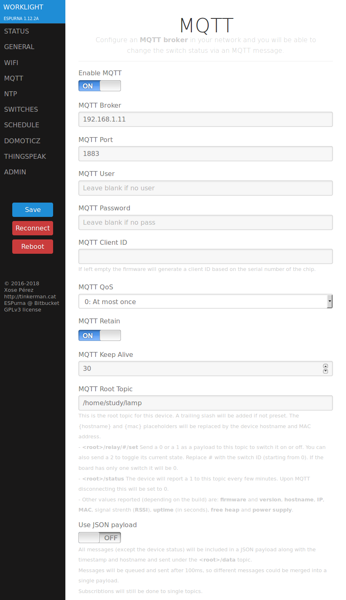

# MQTT

MQTT stands for "Message Queueing Telemetry Transport". It uses the publisher-subscriber pattern and it's especially suited for small messages when networks bandwidth is limited or when the network is not reliable. It has become a de facto standard for sensor messaging over TCP.

Check [MQTT.org](http://mqtt.org/) for more info.

ESPurna is built by default with support for MQTT v3.1. To build an image without MQTT support set the MQTT_SUPPORT setting to 0. The current version also supports MQTT over SSL but it is disabled by default since this feature has a heavy memory footprint and is not compatible with other features in the firmware. See "SSL support" below.

## Configuration

You can configure MQTT via the web interface or the terminal. Check the commands available in the [Terminal](Terminal) page.



## Topic format

### Root topic

Every MQTT message that ESPurna publishes starts with the **root topic** you define in the "MQTT Root Topic" setting. That root topic is then complemented by the **magnitude** (like "temperature", "rfin" or "relay"), an **index** when there is more that one of such elements (more than one relay) and a trailing particle to tell commands from states.

### Commands and states

A **state topic** is what ESPurna broadcasts telling every listener out there about something that happened ("the temperature is 18.3C"). A **command topic** is one ESPurna subscribes to to listen to requests from other services. The default state topic particle is `""` (empty string, meaning no trailing particle). The default command topic particle is `"/set"`.

As an example, a board with one relay will publish the relay status when it changes to:

`{root topic}/relay/0`

And will listen to commands to modify the relay status at:

`{root topic}/relay/0/set`

### Placeholders

The root topic may include one of these placeholders:

Placeholder  | Value
------------ | -------------------------------------------------------
`{hostname}` | The hostname of the board as defined in the General tab
`{mac}`      | The MAC of the ESP8266
`{magnitude}`| The magnitude particle (+1.12.4)

The `{magnitude}` placeholder is a special one. It indicates where the magnitude particle will be inserted. If you don't specify a location for the magnitude it will be inserted after the root topic. For instance, if you have a temperature sensor called "garden", and you set the root topic to `sensor/{magnitude}/{hostname}` the messages will be sent to `sensor/temperature/garden`. In the documentation all topic examples assume the magnitude placeholder is either not used or placed at the end of the root topic.

### JSON payload

When the "Use JSON Payload" option is enabled, messages will be grouped in a JSON payload. Internally, messages will be enqueued and sent after a certain time (100 milliseconds). Any message that is also enqueued during that time lapse will reset the count down. When the count down is done all enqueued messages are grouped in a JSON payload and sent to the `data` specific message topic along with some extra info.

For instance, a sensor that reports temperature and humidity will publish two topics every X seconds like this:

```
{root topic}/temperature => 18.3
{root topic}/humidity => 65
```

With the "Use JSON payload" option enabled only one message will be sent:

```
{root topic}/data => {'temperature': 18.3, 'humidity': 65, 'datetime': '2018-01-31 23:46:17', 'mac': '00:11:22:33:44:55', 'hostname': 'MINI', 'ip': '192.168.1.105', 'id': 37}
```

## Messages

### Heartbeat

Heartbeat messages are only state messages and are sent every X seconds (5 minutes by default). These messages report the status of the device and some useful info.

State topic             | Example payload       | Notes
----------------------- | --------------------- | ------------------
`{root topic}/status`   | `1`                   | see note 1 below
`{root topic}/app`      | `ESPURNA`             |
`{root topic}/version`  | `1.12.3`              |
`{root topic}/hostname` | `MINI`                |
`{root topic}/ip`       | `192.168.1.105`       |
`{root topic}/mac`      | `00:11:22:33:44:55`   |
`{root topic}/uptime`   | `3215`                | seconds
`{root topic}/datetime` | `2018-02-01 00:03:25` | only if NTP synced
`{root topic}/freeheap` | `22056`               | bytes

(1) This is also the will topic. Upon disconnection and after the keepalive timeout the broker should publish a payload `0` to this topic.

Relay and light status are also sent along with the heartbeat. Check topics for those below.

### Actions

An ESPurna device will subscribe to some generic topics listening for different actions to be performed. At the moment these topics are:

Command topic              | Payload         | Notes
-------------------------- | --------------- | ---------------------------
`{root topic}/action/set`  | `reboot`        | Reboots the device

### Relays

The relay module publishes the relay state and subscribes to command topics to manage the relays via MQTT. The specific message topic will always end with a 0-based index (first relay is index 0).

State topic            | Example payload | Notes
---------------------- | --------------- | -----------------------
`{root topic}/relay/0` | `1`             | 0 for 'off', 1 for 'on'

Command topic              | Example payload | Notes
-------------------------- | --------------- | ---------------------------
`{root topic}/relay/0/set` | `2`             | see note 1 below
`{root topic}/relay/0/set` | `toggle`        | see note 1 below

(1) Relay command payloads accept both numbers (`0` for off, `1` for on and `2` for toggle) or words (`on`, `off`, `toggle` or `query`; case insensitive). The `query` payload does not change the relay state but triggers a state topic message.

### Lights

The light module publishes and subscribes to different topics.

State topic               | Example payload | Notes
------------------------- | --------------- | -------------------------------------
`{root topic}/rgb`        | `#FF0000`       | if "Use CSS style" is on
`{root topic}/rgb`        | `255,0,0`       | if "Use CSS style" is off
`{root topic}/hsv`        | `300,100,100`   | see note below
`{root topic}/brightness` | `35`            | from 0 to 255
`{root topic}/channel/0`  | `128`           | from 0 to 255, see note 1 below

Command topic                 | Example payload | Notes
----------------------------- | --------------- | -------------------------------------
`{root topic}/rgb/set`        | `#FF0000`       | in CSS format
`{root topic}/rgb/set`        | `255,0,0`       | or CSV (comma-separated-values)
`{root topic}/hsv/set`        | `300,100,100`   | see note 2 below
`{root topic}/brightness/set` | `35`            | from 0 to 255
`{root topic}/channel/0/set`  | `128`           | for each channel, from 0 to 255
`{root topic}/mired/set`      | `320`           | color temperature in Mired
`{root topic}/kelvin/set`     | `6000`          | color temperature in Kelvin

(1) Channel topic will end with a 0-based index of the channel. In particular, for an RGB bulb, red channel is index 0, green is index 1 and blue is index 2.  
(2) Hue value ranges from 0 to 360. Saturation and Value from 0 to 100.

### Sensors

The sensors module (sensors.ino) provides a common interface with the rest of the firmware for all sensor defined in the sensors folder. See [Sensors](Sensors) for more info about the available sensors.

Sensors publish magnitudes (temperature, power, current, co2,...). If there is more than one magnitude of the same type and index will be added to the magnitude topic (0-based). Available magnitude topics will depend on the available sensors. At the moment they are:

State topic                 | Example payload | Notes
----------------------------| --------------- | ---------------------------
`{root topic}/temperature`  | `18.3`          | in C or F, see note 1 below
`{root topic}/humidity`     | `65`            | in % 
`{root topic}/pressure`     | `1018.52`       | in hPa
`{root topic}/current`      | `0.35`          | in A
`{root topic}/voltage`      | `227`           | in V
`{root topic}/power`        | `430`           | active power, in W
`{root topic}/apparent`     | `320`           | apparent power, in W
`{root topic}/reactive`     | `100`           | reactive power, in W
`{root topic}/factor`       | `95`            | power factor, in %
`{root topic}/energy`       | `253654`        | aggregated, in J or Wh or kWh, see note 1 below
`{root topic}/energy_delta` | `60`            | since last report, in J or Wh or kWh, see note 1 below
`{root topic}/analog`       | `780`           | from 0 to 1023
`{root topic}/digital`      | `1`             | 0 (low) or 1 (high)
`{root topic}/event`        | `18`            | since last report, count
`{root topic}/pm1dot0`      | `180`           | in ppm
`{root topic}/pm2dot5`      | `13`            | in ppm
`{root topic}/pm10`         | `5`             | in ppm
`{root topic}/co2`          | `65`            | in ppm
`{root topic}/lux`          | `430`           | in lux
`{root topic}/distance`     | `0.128`         | in meters
`{root topic}/hcho`         | `18`            | in ppm
`{root topic}/ldr_cpm`      | `24`            | events
`{root topic}/ldr_uSvh`     | `0.108`         | in microsievert
`{root topic}/count`        | `12`            | events

(1) Temperature and energy units are defined in the Sensors tab in the web UI.

### Buttons

The button module publishes button events. The specific message topic will always end with a 0-based index (first button is index 0).

State topic             | Example payload | Notes
----------------------- | --------------- | ---------------
`{root topic}/button/0` | `3`             | see table below

The payload value is the one defined by the BUTTON\_EVENT\_* settings. 

Button event    | Value
--------------- | -----
Press           | 1
Release         | 2
Click           | 2
Double click    | 3
Long click      | 4
Long-long click | 5

Notice "release" and "click" events are actually the same. Some devices will report both the pressed and the released events whilst other might only report click events. In either case a value of `2` will mean something has happened and an action can be taken.

### LEDs

When the LED mode in the General tab is set to "MQTT Managed", the first LED will accept a command to change its state. Valid values are the same as for a relay (0, 1, 2, 'on', 'off' or 'toggle'). The specific message topic will always end with a 0-based index (first LED is index 0).

Command topic            | Example payload | Notes
------------------------ | --------------- | -----------------
`{root topic}/led/0/set` | `2`             | toggle LED status

### Sonoff RF Bridge

The Sonoff RF Bridge has a dedicated module (rfbridge.ino) that provides an MQTT to RF bridge functionality via the `rfin` and `rfout` topics.

State topic         | Example payload      | Notes
--------------------| -------------------- | -----------------
`{root topic}/rfin` | `26C0013603CA511451` | received code

Command topic                | Example payload        | Notes
---------------------------- | ---------------------- | -----------------
`{root topic}/rflearn/0/set` | `1`                    | see note 1 below
`{root topic}/rfout/set`     | `26C0013603CA511451`   | send code
`{root topic}/rfout/set`     | `26C0013603CA511451,3` | send code N times
`{root topic}/rfraw/set`     |                        | see note 2 below

(1) Triggers a learn action. The index after the "learn" magnitude indicates the relay the code will be linked to. The payload of the message indicates the action (`0` for off, `1` for on).  
(2) Raw codes require a special firmware in the EFM8BB1. See issue #386 for more info.

### IR

The IR module enables different MQTT messages in and out via the `irin` and `irout` topics.

State topic         | Example payload      | Notes
--------------------| -------------------- | -----------------
`{root topic}/irin` | `2:121944:32`        | &lt;type&gt;:&lt;code&gt;:&lt;bits&gt;

Command topic                | Example payload        | Notes
---------------------------- | ---------------------- | -----------------
`{root topic}/rfout/set`     | `2:121944:32:1`        | &lt;type&gt;:&lt;code&gt;:&lt;bits&gt;[:&lt;repeat(1)&gt;]

The IR module also supports RAW messages when IR_USE_RAW is enabled but format is much more complex. Read the module header for more info.

### UART-MQTT module

The UART-MQTT module enables a transparent bridge to and from MQTT to a hardware UART. This is especially interesting for UART sensors like barcode scanners or RFID readers.

State topic           | Example payload      | Notes
--------------------- | -------------------- | -----------------
`{root topic}/uartin` | `245324234`          | 

Command topic                | Example payload        | Notes
---------------------------- | ---------------------- | -----------------
`{root topic}/uartout/set`   | `245324234`            | 

## Features based on MQTT

### Relay & color synchronization across devices

* mqttGroup
* mqttGroupInv

### Home Assistant auto-discovery
### Domoticz

## Implementation

### AsyncMqttClient vs PubSubClient
### mqttRegister

## SSL support

### Memory limitations
### Build image with SSL support
### Suggested configuration
### Server footprints

