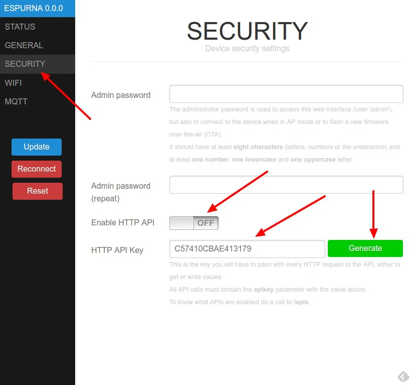

# REST API

The ESPurna firmware exposes a [REST](https://en.wikipedia.org/wiki/Representational_state_transfer) [API](https://en.wikipedia.org/wiki/Application_programming_interface) you can use to query or change relay statuses and query sensor values.

## Security

The REST API is disabled by default. You will have to enable it first from the web interface in the "Security" tab. You will also have to take note of the API KEY you must use in every query to the REST API. This key is autogenerated or you can generate a new one click the "Generate" button.



## Testing the API

To test the API you can use a normal browser (for GET requests), a GUI tool like [Postman for Google Chrome](https://chrome.google.com/webstore/detail/postman/fhbjgbiflinjbdggehcddcbncdddomop) or cURL from the terminal in Linux and MacOS machines.

cURL is used in the examples for simplicity, I hope everyone will get the idea.

## API entry points

The entry points are the URLs you can get or send values from/to. The represent physical entities (like relays) or magnitudes (like "temperature"). The available entry points will depend on the sensors you have enabled in your device.

To know what API entry points you can use there is a special URL that summarizes them:

```
$ curl http://192.168.1.108/apis?apikey=C62ED7BE7593B658
relay0 -> /api/relay/0
relay1 -> /api/relay/1
temperature -> /api/temperature
humidity -> /api/humidity
```

You can also enter this URL in the web browser (http://192.168.1.108/apis?apikey=C62ED7BE7593B658).

Also, you can specify you want the output in JSON format (to use it from a web app, for instance):

```
$ curl -H "Accept: application/json" http://192.168.1.108/apis?apikey=C62ED7BE7593B658
{ "relay0":"/api/relay/0","temperature":"/api/temperature","humidity":"/api/humidity"}
```

## Relay management

You can query or set the relay status using the REST API. To query the relay status you have to issue a GET request like the previous one to the relay entry point:

```
$ curl -H "Accept: application/json" http://192.168.1.108/api/relay/0?apikey=C62ED7BE7593B658
{ "relay0": 1}
```

To change the relay status you have to send a PUT request with the new value in the "value" parameter. This new value can be 0 to turn it off, 1 to turn it on or 2 to toggle it:

```
$ curl -X PUT -H "Accept: application/json" http://192.168.1.108/api/relay/0 --data "apikey=C62ED7BE7593B658&value=2"
{ "relay0": 0}
$ curl -X PUT -H "Accept: application/json" http://192.168.1.108/api/relay/0 --data "apikey=C62ED7BE7593B658&value=2"
{ "relay0": 1}
```

Since version 1.6.4 you can also change the relay value via a GET request.

```
$ curl "http://192.168.1.108/api/relay/0?apikey=C62ED7BE7593B658&value=2"
relay0 => 0
$ curl "http://192.168.1.108/api/relay/0?apikey=C62ED7BE7593B658&value=2"
relay0 => 1
```

## Color changing

From version 1.7.0 if your device has an RGB light source you can control the color via API too (both GET and PUT, "%23" is the URL encoded value for '#'):

```
$ curl -X PUT -H "Accept: application/json" http://192.168.1.108/api/color --data "apikey=C62ED7BE7593B658&value=%23FF0000"
{ "color": "#FF0000" }
$ curl "http://192.168.1.108/api/color?apikey=C62ED7BE7593B658&value=%23FF0000"
#FF0000
```

## Sensor values

Sensor values can be queried in the same fashion using GET requests:

```
$ curl -H "Accept: application/json" http://192.168.1.108/api/temperature?apikey=C62ED7BE7593B658
{ "temperature": 21.5 }
```

## Examples using Postman

Postman is an Desktop and Google Chrome App to test and develop APIs. You can download it and install it from the [App Store in your Chrome browser](https://chrome.google.com/webstore/detail/postman/fhbjgbiflinjbdggehcddcbncdddomop) or for your desktop from [https://www.getpostman.com](https://www.getpostman.com). Here are a couple of screenshot of Postman querying the ESPurna API.


## Examples using PowerShell

PowerShell is a scripting language used on windows. This example used the REST API to first query the Sonoff S20 relais, and then toggle it.

$result = $null #clear vars
$base = 'http://192.168.4.100/' #change this to your devices IP
$key= 'apikey=F7DDDA33EEAFGB' #chaqnge this to you API key as generated in the web interface
$request = 'api/relay/0' # depending on your device you can add more relays or sensors
$headers = New-Object 'System.Collections.Generic.Dictionary[[string],[string]]'
$headers.Add('Accept','application/json') # I like to get a JSON result, so that we can use the returned objects immediately

# build the string we will use to query the device
$uri = $base+$request+ '?' + $key # read the switch
'current value:'
$result = Invoke-RestMethod -Headers $headers -uri $uri -Method Get
$result
'toggled:'
$uri = $base+$request+ '?' + $key + '&value=2' #toggle the switch
$result = Invoke-RestMethod -Headers $headers -uri $uri -Method get
$result