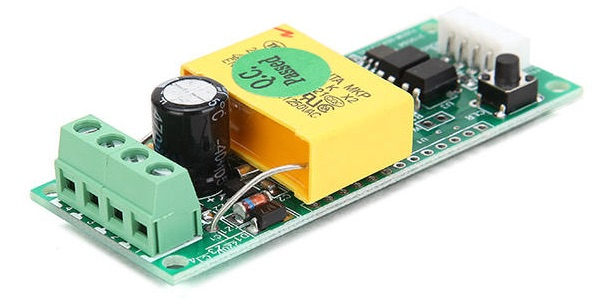
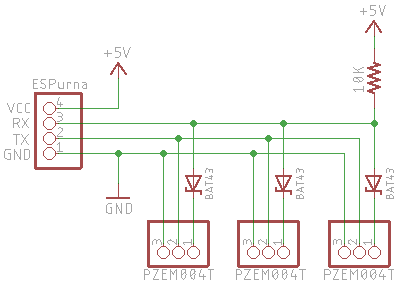

# PZEM004T Energy Monitor



|Property|Value|
|---|---|
|Manufacturer|PEACEFAIR|
|Product page|[AliExpress](https://www.aliexpress.com/store/product/PEACEFAIR-AC-100A-Electric-power-monitoring-and-communication-module-power-meter-power-energy-Volt-Ammeter-with/1773456_32405328185.html)|
|Wiki page|[ESPurna Wiki](https://github.com/xoseperez/espurna/wiki/Sensor-PZEM004T)|
|Build flag|`PZEM004T_SUPPORT`|

## Introduction

These are cheap Energy monitors devices, equipped with a TTL UART communication interface, it can monitor
Voltage, Current, Power, and Energy.

_NB.: These devices are 5V, usually, ESP devices are using ESP8266 which is 5V tolerant [1], Sonoff Basic
devices have 5V onboard, so you don't need to mod your PZEM004T to work with ESP8266 devices._

## Sensor Behaviour

Differently than the first implementation(See commit 3704d366637), this version(See PR #1304) pools
device(s) magnitudes every `PZEM004T_READ_INTERVAL`. A magnitude of a device is read on each sensor `tick`.
This will offload the main thread, as the PZEM004T can take up to 1000ms to answer the request. Same
magnitudes are read one after another, so they can be better synced.

## Basic Configuration (Single device)

You only need to connect 4 pins to ESPurna device to work:

1. VCC
2. TX
3. RX
4. GND

ESPurna's GPIO vary among devices, check the documentation of your device.

You must enable the build flag `PZEM004T_SUPPORT` to enable this sensor.

Nothing is needed to be done in this single configuration, the device address will be set to the device
on power on, works out of the box.

## Advanced Configuration (Multiple devices)

Each PZEM004T device has an internal device address(Coded in the _form_ of an IP Address but doesn't
need to conform, you can have 0.0.0.0 for example), which can be used to create a pseudo-master/slave bus,
allowing to connect multiple devices to the same UART, thereby eliminating software serials, etc.

ESPurna firmware has all the instrumentation to build this kind of bus.

### Connection

To create a master/slave UART bus, you need a resistor(10K) and some Small Signal Schottky Diode(Like
BAT43), the connection diagram is the following:



### Configuration

You need to specify in `config/sensors.h` the addresses of the devices:

```
#define PZEM004T_ADDRESSES "1.1.1.1 2.2.2.2 3.3.3.3"
```

Also, you need to configure these addresses in the devices itself, see `PZ.ADDRESS` command below.

## Commands

PZEM004T sensor implementation provides 3 commands to manage the device(s). When specified `ADDRESS`,
it is the address set on the device, like `192.168.1.1`, `1.1.1.1`, etc. When specified `DEVICE_INDEX`,
is the internal's device index, the order is defined by the addresses in the `PZEM004T_ADDRESSES` build
flag. The command's output is: `Device DEVICE_INDEX/ADDRESS`.

### `PZ.ADDRESS`
Allows you to read and to set the address.

Usage: `pz.address [ADDRESS]`

If `ADDRESS` is *_not_* provided, it will read the addresses of the devices configured in the firmware, eg:
```
$ pz.address
[7325151] [SENSOR] PZEM004T
[7325153] Device 0/192.168.1.1
[7325155] Device 1/192.168.1.2
[7325157] Device 2/192.168.1.3
[7325159] +OK
```

If `ADDRESS` is provided, it will issue a `set address` command to the bus. If the command doesn't return
a `+OK` the command has failed.

```
$ pz.address 192.168.1.1
+OK
```

_NB.: Keep in mind that you must have *ONLY ONE* device connected to the bus when issuing this command,
otherwise, all devices will have the same address and a collision will occur on the response, the result
is undetermined._

### `PZ.RESET`

Allows you to reset the accumulated energy value. Will read current energy value and store as the initial
value, thus, the next reading will be 0(zero).

Usage: `pz.reset [DEVICE_INDEX]`

if `DEVICE_INDEX` is *_not_* provided, will reset all devices, eg:
```
$ pz.address
[7325151] [SENSOR] PZEM004T
[7325153] Device 0/192.168.1.1 - Offset: 3.4142
[7325155] Device 1/192.168.1.2 - Offset: 1.2344
[7325157] Device 2/192.168.1.3 - Offset: 7.4523
[7325159] +OK
```

if `DEVICE_INDEX` is provided, will reset only the provided device, eg:
```
$ pz.address 1
[7325151] [SENSOR] PZEM004T
[7325155] Device 1/192.168.1.2 - Offset: 1.2344
[7325159] +OK
```

### `PZ.VALUE`

Allows you to read the last reading, not necessarily the 

Usage: `pz.reset [DEVICE_INDEX]`

```
$ pz.address
[7325151] [SENSOR] PZEM004T
[7325155] Device 0/192.168.1.1 - Current: 1.1254 Voltage: 128 Power: 144 Energy: 3.4142
[7325155] Device 1/192.168.1.2 - Current: 3.2114 Voltage: 128 Power: 412 Energy: 1.2344
[7325155] Device 2/192.168.1.3 - Current: 6.2547 Voltage: 128 Power: 801 Energy: 7.4523
[7325159] +OK
```

[1] [5V Tolerant, CEO, Teo Swee Ann has Spoken](https://hackaday.com/2016/07/28/ask-hackaday-is-the-esp8266-5v-tolerant/#comment-3122361)
