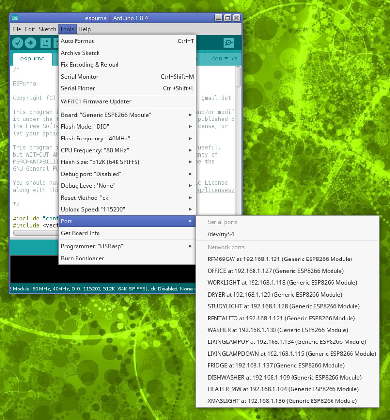

# Two-Step updates

## Introduction

As more and more features get packed into the firmware the binary image grows bigger. Until a few weeks ago it was one of my requirements to build images below the 512000 bytes size. That's the maximum size of an image so two of them would fit in a 1MB flash memory using the '1M (no SPIFFS)' memory layout.

The flash memory is split into 4096 bytes sectors, so a 1MB flash memory has 256 sectors. One of those sectors is used for EEPROM and 4 more are reserved space at the end of the flash. That leaves us with 251 sectors for code (assuming no SPIFFS partition). And that means the code must not be larger than 125 sectors to be able to do OTA. That's 512000 bytes or 500Kb.

ESPurna is close to that limit and I have sacrificed some features that are disabled by default so the limit is not met. But with the release of Arduino Core 2.4.0 things have gone worst on the size battle, albeit much better on other aspects.

That's why I'm starting to use another approach: **the two-step updates**. The idea behind it is to flash a stripped-down version of the firmware first, lighter and with the minimum features required to flash it again with the real, full-featured image. This lighter version is the ESPurna Core binary and right now it's 290Kb. This means that using this method you can now flash an image of up to ~712Kb.

Of course, it's not as easy as it is doing a single flash, but I think it's worth it.

## Procedure

Well, as the name says, you will have to flash over-the-air your device twice. The first time with the `espurna-X.X.X-espurna-core.bin` image and the second one with the specific image for your device. You can do the first OTA upgrade using Arduino OTA or via the web interface, just like you do now.

But for the second upgrade (from the core image to the final device image) only the Arduino OTA procedure is available at the moment. From the Arduino IDE you can build the image and flash it selecting the proper "Network Port" that points to your device (under "Tools > Port > Network ports").

If you are using PlatformIO you can build and flash the image providing the IP of the device as the Upload Port:

`platformio run -e itead-sonoff-basic-ota -t upload --upload-port=192.168.1.115`

Finally, if you are using PlatformIO, you can also use the ESPurna OTA Manager (still a beta feature) that will guide you throu the process...

Starting from 1.12.4 you can also upgrade de firmware from the Terminal providing the URL of an image. Check [Updating from the Terminal](https://github.com/xoseperez/espurna/wiki/OTA#updating-from-the-terminal).

## About ESPurna Core

The ESPurna core image is basically a stripped-off version of the ESPurna firmware without several features that usually come bundled in. So, aside from the features that are not enabled by default, you don't have either:

* Alexa support
* Domoticz support
* Home Assistant auto-discover
* I2C support
* MQTT
* NTP sync
* Web interface
* HTTP API
* Sensors
* Scheduler
* Thinkspeak support

But you do have: 

* mDNS
* OTA
* Telnet
* Terminal
* WiFi
